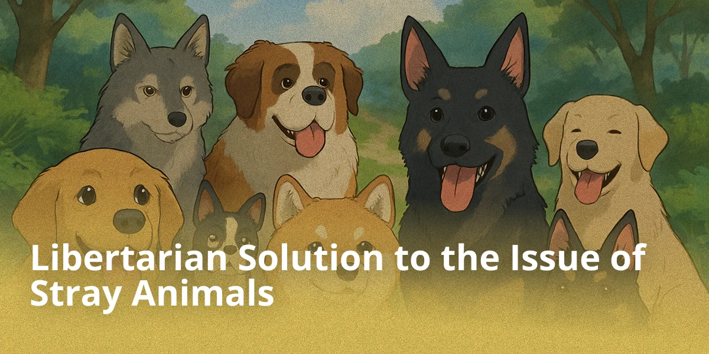

## Introduction

The problem of stray animals remains relevant for many regions of Russia, including the Khabarovsk Krai. In 2024, instead of developing comprehensive and humane solutions, the regional authorities supported a law that allows euthanasia of animals after a certain period of time spent in a shelter.

City streets are filled with animals that may either pose no danger or become a threat to residents. In Russia, the solution to this problem is traditionally entrusted to state structures, while the libertarian approach offers minimization of state intervention, emphasizing greater responsibility of citizens and private foundations.

## State Solution to the Problem: The Example of Romania

Russia and Romania are striking examples of state intervention in the regulation of the stray animal population. Despite differences in political systems and approaches to solving public issues, state measures in both countries have demonstrated their inefficiency. 

Romania, as a member of the European Union, is formally obliged to observe humane treatment of animals. However, in the 2010s, the country's authorities chose a radical method of dealing with stray dogs — mass capture for further euthanasia, which was a response to a sharp increase in the number of animals on city streets. 

Although in the short term such measures gave the appearance of solving the problem, they did not eliminate its root cause — the irresponsible attitude of owners towards animals and the lack of systemic sterilization programs. Very quickly, instead of the euthanized packs, puppies and kittens of animals thrown onto the street began to appear, forming new packs. 

## The Experience of Combating Stray Dogs in Russia: The 2014 Olympics Example

Before the Sochi Olympics, Russian authorities resorted to mass shooting and poisoning of animals to create a positive image for the host city. However, as in the case of Romania, this method proved ineffective. The temporary reduction in the number of animals on the streets did not lead to a sustainable result — after the Olympics, the stray dog population began to grow again.

Instead of mass killing, local activists proposed spending the 1.7 million rubles allocated for the problem on sterilizing both stray and domestic animals, which, although it would not solve the problem in the short term, would help the city combat it in the long run. 

## The Libertarian Model for Solving the Stray Animal Problem

The libertarian approach is based on the deregulation of state control exercised by Rosprirodnadzor and Rosselkhoznadzor, and transferring the initiative into the hands of citizens and private organizations. 

Animal protection organizations and private individuals are already independently engaged in capturing, sterilizing, rehoming, and keeping animals. This avoids bureaucracy and makes the process of helping more flexible and prompt. 

Instead of state institutions, private shelters are established and developed, existing through charity and volunteering. This approach promotes more efficient use of resources, as shelter owners are motivated to improve the quality of animal care and operational transparency, which determines the receipt of donations.

Thanks to deregulation, the following will also develop:

- **Private veterinary clinics** offering affordable sterilization and treatment services
- **Animal hotels and temporary boarding facilities**, allowing temporary placement of pets
- **Services for finding new owners**, operating on a commercial or charitable basis

## Public Participation

The most important element of this approach is fostering a responsible attitude towards animals through educational initiatives and information programs. The same private shelters and volunteers will be interested in creating them to ease their own work. Consequently, people will throw animals onto the street less often and will start helping shelters with their upkeep.

An excellent example is Turkey, whose population treats street animals not as a threat, but as neighbors: they build doghouses at their own expense, bowls of food and water can often be seen next to cafes and shops, and municipalities assist volunteers with sterilization.
 
## Conclusion

The state continues to try to solve the stray animal problem through strict regulation and centralized control. In practice, this model demonstrates persistent inefficiency.

Shelters and capture services are funded from the public budget — meaning from taxpayers' pockets, regardless of their attitude towards the measures applied. At the same time, the efficiency of these structures raises serious questions: expenses are growing, reporting is convoluted, and in practice, we increasingly face bureaucracy and indifference. Private initiatives that could work faster, more humanely, and cheaper run into a wall of prohibitions, licenses, and formalities. As a result, everything is stalled except the problem itself.

Libertarians propose moving in a different direction — trusting people, not officials. Where the state system loses touch with reality, personal responsibility comes to the forefront. Shelters, volunteers, and kind initiatives all work better when they are not bound hand and foot by regulations.
