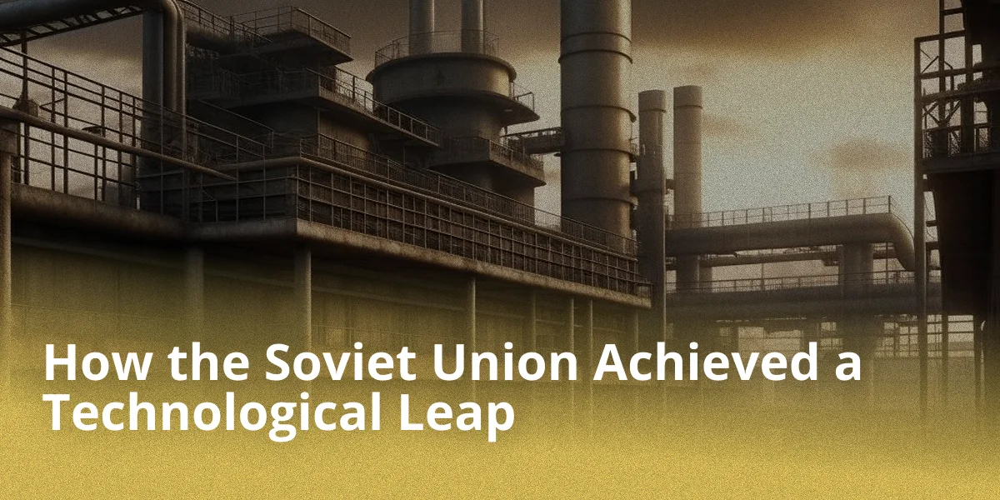
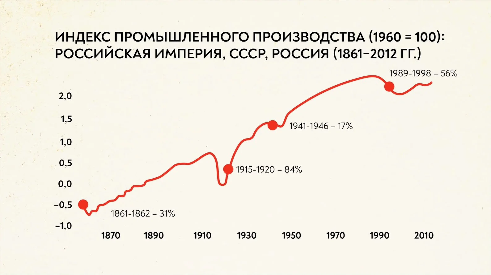

## Introduction

### Relevance of the Topic

The relevance of this study is due to the need for the scientific community to understand the tools by which the USSR achieved a technical leap, what role it played in restoring the economy to the levels of the Russian Empire on the eve of the revolution, and to study the role of foreign capital and technology during the 1930s-1950s in the economy and industry of the USSR.

### Object and Subject of Study

Object of study — the USSR.

Subject of study — the technological leap in post-revolutionary Russia.

### Objective of the Study

The objective of this work is to establish the reasons for the technological leap of the USSR in the 1930s-1950s, as well as to identify the tools used during this process.

## Reasons for the Technological Leap

The basis for the measures that contributed to the technological and economic recovery to the levels of pre-revolutionary Russia was the government's realization of the significant lag of the Soviet economy behind Western countries.

## Preface

The technological breakthrough is connected with the process of industrialization implemented in the USSR in the early 20th century. Industrialization is a process of accelerated socio-economic transition from a traditional stage of development to an industrial one, with industrial production dominating the economy.

## Main Part

In the early 1930s, the leadership of the USSR, headed by Stalin, decided to establish a powerful heavy industry in the country as the foundation of the socialist economy, the military-industrial complex, and the fuel and energy sector, to develop transport, especially automotive and aviation, and tractor manufacturing as the technical base for the collectivization of villages. The country's leadership assumed not only that large, high-productivity enterprises satisfy the needs of the national economy faster and more fully, but also that they are easier to manage from the center, making it possible to eliminate the remnants of the traditional multi-structured system — the mass of small-scale artisanal productions.

The first five-year plan was implemented in 1928-1932. During its execution, a large number of construction projects were launched — UralMash, ZIS, and others. The first five-year plan was completed in four years, and this success inspired the workers. The plan envisaged the development of electric power, requiring the creation of 30 power plants in 15 years.

The second five-year plan began in 1933 and ended in 1937. People worked in three shifts, driven by the desire to realize a common idea. During this period, the model of industrialization changed. The emphasis was now on quality rather than sheer volume. Personalities like Stakhanov, Busygin, Chkalov, and others became famous.

The third five-year plan started in 1938 but was interrupted in 1941 due to the outbreak of war. The main task of this stage was the need to catch up with and surpass Western countries in per capita production. This was intended to be achieved by reducing spending on the military-industrial complex.

The industry, developing at a rapid pace and restructuring its material and technical base, changed its internal structure on the basis of explosive growth in heavy industry and the formation of new branches of production.

On this basis, a socialist reconstruction was launched, resulting in the creation of a modern, advanced industry, the reconstruction of agriculture, the completion of the foundations of a socialist economy, and thus ensuring the construction of a classless socialist society during the implementation of the next five-year plan.

The magnitude of the recovery role that industry took on in the national economy of the USSR is evidenced, in particular, by the amount of material assets that industry gave the country during the five-year plan years and which it was capable of providing by the end of the five-year plan.

The metallurgical industry solved the tasks of providing metal to the machine-building sector. The share of machine building and metallurgy in the consumption of rolled metal grew from 47.9% in 1926/27 to 68.1% in 1929/30 and more than 71% in 1931 and 1932.

The role of industry in providing the country with advanced technology grew especially. Industry exerted a revolutionary influence on the entire structure of production. Simultaneously, the capacity of industry to supply tractors to agriculture grew year by year. For example, while agriculture received over 153.9 thousand tractors in four and a quarter years, in 1932 alone, Soviet industry produced 50 thousand tractors. The output of all agricultural machinery in 1932 was more than 5.5 times higher than in 1927/28.

## Foreign Capital

Solving these issues with the help of the West — in the form of investments (through concessions) or paid technical assistance — was the only way out. A few years after the winding down of the New Economic Policy (NEP), the granting of concessions ceased. While the import of machinery and equipment continued, other relations with Western firms developed, which had originated during the NEP period.

Attempts to design and build large, technically complex enterprises were unsuccessful. The first Soviet project for the Magnitogorsk Iron and Steel Works, the construction of the Stalingrad and Chelyabinsk tractor plants, the Svir hydroelectric power plant, etc., failed. The main reason was directives to increase the size of enterprises and rush them into operation. The first and second five-year plans aimed at creating the newest capital-intensive industries: aviation, automotive, tractor, chemical, machine-building, electrical engineering, and related industries, as well as locating industry to the east and south of the Urals, in territories remote from the borders. By 1933, it was necessary to build and reconstruct about 1,500 facilities.

Technical assistance was provided under special agreements or included in equipment supply contracts. These were much shorter than concessions and more attractive to foreign firms as they did not require risky investments. During the 1930s depression, Western companies had an increased need for large orders, and the USSR had the opportunity to quickly master advanced technologies and production skills.

The Dnieper Hydroelectric Station was built according to a Soviet design, but with the involvement of the American company Cooper Engineering and the German firm Siemens as consultants. The largest tractor plants in Europe, the Stalingrad, Kharkov, and Chelyabinsk tractor plants, the Magnitogorsk Iron and Steel Works, and the Nizhny Novgorod (Gorky) Automobile Plant were built on the American model and were of American origin. Albert Kahn, Inc., Ford Motor Company, International General Electric, International Harvester, and Radio Corporation of America became foreign partners of the Soviet Union.

According to domestic data, in 1923-1933, 170 technical assistance agreements were concluded in the heavy industry sectors of the USSR: 73 with German firms, 59 with American, 11 with French, 9 with Swedish, and 18 with firms from other countries. It is not possible to determine whose assistance was decisive, since many construction projects became "international." For example, the Vostokostal association signed a contract with the American firm Arthur McKee to create a master plan for the Magnitogorsk Works, with the German firm Demag to design its rolling mill, and another German firm took over the drilling work for Magnitostroy. The All-Union Chemical Association "Vsekhimprom" had 20 contracts with companies from the USA, Germany, Italy, France, Norway, Sweden, Switzerland, etc.

For various reasons, 37 of the 170 contracts were terminated prematurely. According to Soviet estimates, some proved too expensive, others were of little use, and others did not fit the five-year schedule. In some cases, the production base proved insufficient for the use of the latest technology, or it had been mastered before the contract expired. Increasing the volume of work performed by Arthur McKee without additional compensation led to the termination of the contract. Disagreements on financial and other issues prevented the Detroit company A.J. Brandt from completing the technical reconstruction of the AMO automobile plant in Moscow. It is possible to highlight two circumstances that significantly reduced the use of technical assistance after 1933. First, the success of industrialization itself. Many new and reconstructed enterprises began production, and some themselves became centers for spreading advanced technologies and training. Second, the huge expenses, which were tightly controlled by the Valyutnaya Komissiya (Currency Commission) of the Politburo, which influenced all decisions on purchases abroad.

## Alternative Point of View

If we look at the graph of the long-term development of the Russian economy, it becomes clear that Stalinist industrialization was by no means a breakthrough. The actual growth of the economy in the 1930s fit into the long-term trends of the country's development, and they would have been achieved by Russia even without the horrors of the revolution, collectivization, and GULAG labor.

In 2013, a group of economists published a study according to which, even under the most unfavorable rates of development, the NEP would have achieved successes similar to the results of forced industrialization. It turned out that by the early 1940s, the country would have arrived at almost the same per capita GDP as was in the actual Soviet Union. And if market reforms had been expanded in the late 1920s, per capita GDP could have exceeded the Stalinist figure.

In order to achieve the redistribution of labor from villages to cities, the Soviet leadership did not raise the standard of living in the cities, but pursued a suffocating policy in the villages. This ended in a national catastrophe — the famine of 1932-1933, during which 7 million people died.

## Conclusion

The leadership of the USSR after Stalin's death was at a crossroads. While Malenkov's reforms were more liberal, Khrushchev modified the Stalinist course.

The volume of investment was sharply increased: for 1956-1959, state investments of 990 billion rubles were planned; thus, investments in the Soviet economy over these three years exceeded the entire previous five-year plan developed under Stalin. In addition, management reform began: the introduction of sovnarkhozes.

Summarizing the above, it becomes clear what tools were used during the creation of the industrial and economic leap in the USSR in the early 20th century, as well as the efficiency of individual components of this large chain.

## References

1. Cheremukhin, Anton and Golosov, Mikhail and Guriev, Sergei and Tsyvinski, Aleh and Tsyvinski, Aleh, Was Stalin Necessary for Russia's Economic Development? (September 2013). NBER Working Paper No. w19425, Available at SSRN: https://ssrn.com/abstract=2325798

2. Gregory, Paul R. Russian National Income, 1885-1913. Cambridge Univ. Press, 1982.

3. Markevich Andrey, Harrison Mark. Great War, Civil War, and Recovery: Russia's National Income, 1913 to 1928. The Journal of Economic History, Vol. 71, No. 3 (September 2011). ( https://www.nes.ru/files/Preprints-resh/WP146.pdf )

4. Borodkin, Gregory, "Russia’s Industrial Growth In the First Stage of Industrialisation (1880s-1913)" ( https://archive.org/details/borodkin_gregory/page/n9/mode/2up )

5. Alexander Gerschenkron (1947). Supplement: Economic Growth: A Symposium || The Rate of Growth in Russia: The Rate of Industrial Growth in Russia, Since 1885. The Journal of Economic History, 7(), 144–174.

6. Markevich Andrei. State and Market in Russian Industrialization, 1870–2010

7. NES Lecture: https://youtu.be/PczQgFV3C2w

8. Korchagina Sofya Ilyinichna, Cherepukhina Vasilisa Sergeevna, Chernyavskaya Ekaterina Nikolaevna SOCIO-ECONOMIC DEVELOPMENT OF THE USSR IN THE 1920s - 1930s (Accessed: 13.12.2022).
