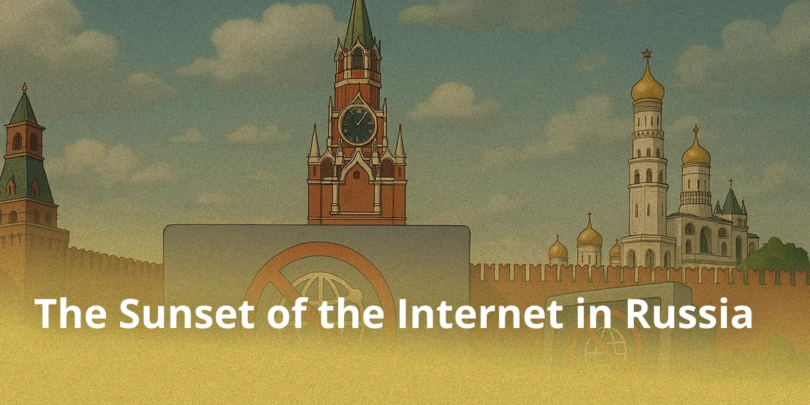

## Disclaimer

In this article, we will try to look into the future of the Internet for the next five years and understand what changes are already knocking on our digital door. This is a subjective view of the author, and therefore disputes and discrepancies with the real course of events are possible, but this is precisely the point of a forecast and public discussion.

## Isolation of the Russian Segment

Over the past four years, Russia has gradually transitioned to the implementation of the concept of digital sovereignty. In the near future, the actual separation of the domestic segment of the Internet from the global network is expected. This step will lead to the termination of access to foreign resources that refuse to cooperate with domestic security structures.

The mass blockages of foreign platforms observed today are becoming an obvious part of this process. It is increasingly noticeable that they function as preliminary preparation — a kind of training before the complete transition to a closed digital ecosystem. Thus, a structure is gradually forming that is oriented towards domestic services controlled and regulated within the national legal field.

In Russia, a model of Internet access is forming in which free and anonymous connection is gradually replaced by a system of digital identification through government services. Login "by passport" and through state applications ceases to be a hypothetical scenario and is increasingly described as a likely vector of regulatory development.

By the end of this decade, the trajectory of the development of the Russian segment of the network will, with a high degree of probability, lead to a model conceptually close to the Chinese-North Korean version of a "national internet." We are talking about the transformation of a previously global and relatively open environment into an isolated, tightly filtered contour dominated by internal platforms, with a shrinking space for uncontrolled external communications.

## Single Point of Entry

A key link in this system is the infrastructure of the "Gosuslugi" portal and associated state digital platforms, including regional applications and new services embedded in the e-government ecosystem. The "Maks" application passes through the same infrastructure: the authorities promote it as a "national messenger," effectively embedding it into a single bundle of state digital channels. Already today, these channels are used not only to provide services, but also to implement technical control mechanisms, which makes them a convenient "assembly point" for the future network access control model.

Without an account in these services, you simply won't be able to log into a Yandex account or any other Russian service, game, or application. In fact, the absence of such an account is equivalent to disconnecting from the Internet — digital life in Russia becomes impossible without this "pass." An environment is forming in which digital identity acts as the main mechanism for authorization and access to network resources.

At first, such measures will be presented as a step for the good, for the protection of children and public safety. Over time, however, they will become massive and affect everyone without exception.

## State Biometrics Bank

Continuing the analysis of possible outcomes with the Russian segment of the Internet, it is worth mentioning the state's love for citizens' biometrics. The widespread use of biometrics for identification in state applications will become a key element of the unified access system.

The State Biometrics Bank, accumulating the data of millions of citizens through the Unified Biometric Registry (EBR), already positions itself today as an infrastructural hub for verification in the digital ecosystem. In a RuNet isolation scenario, this database will evolve into a universal pass: the "Gosuslugi" portal, the "Maks" messenger, and related platforms will require scanning a face or voice to log in, replacing outdated passwords with continuous biometric monitoring. Such an approach will not only simplify authorization but also provide the authorities with total surveillance: each session, search, and transaction will be tied to a unique biometric profile, allowing them to track the behavior of citizens in real time without their awareness.

The expansion of biometrics will affect not only state systems but also private applications integrated with state infrastructure: banks, delivery services, corporate portals — all of them will acquire a "biometric gateway" under the auspices of the EBR.

## What Do We Already Have? Intentional Slowdowns and Shutdowns

Even now, authorities have access to tools and capabilities such as the centralized slowdown of individual services at the telecom operator level: a prime example is the slowdown of YouTube in 2024–2025 under the pretext of "aging servers" and the need to reduce the load on the infrastructure, with speed limits for high-resolution video while maintaining basic functionality of text and audio content.

The technical basis is traffic analysis and filtration tools (DPI, as well as TSPU installed at operators), provided for by the infrastructure and logic of the law on "sovereign RuNet," which allows selective restrictions without a formal "internet shutdown." In parallel, in 2025, practices of targeted regional mobile internet shutdowns under the pretext of security and infrastructure protection became noticeable, demonstrating the system's readiness for short-term "blackout" modes by territory or event.

## New Realities for Users

If a foreign company is not interested in the Russian market and close cooperation with state bodies, running an application in the Russian Federation becomes virtually impossible, and familiar ways of bypassing blockages stop working. However, for businesses that require resources from such "unfriendly" services, the special services are ready to allocate a separate access line without general blocking through the great Russian firewall. This creates a paradoxical situation: complete isolation for uncontrolled players, but loopholes for the "necessary" ones under strict supervision.

This practice is already widespread in Russia: pro-government bot farms and major IT giants widely use dedicated channels without blocking, getting access to foreign resources under special control. This allows them to avoid the general restrictions of the "great firewall," but requires coordination with the authorities and special services.

Here are some examples of what can be done at the initial stage of applying the "hellish banhammer" to foreign content:

The first method is using eSIMs from foreign operators, such as the French Orange or Estonian Bite. The key advantage of this approach is obtaining a European IP address without the need to use traditional tools like a VPN. This can be especially useful for accessing resources blocked geographically or bypassing local restrictions. However, the solution has significant drawbacks.

Firstly, the cost of eSIM connections remains high. For example, a data package of about 10 GB can cost the user around 3,000 rubles, which makes it economically disadvantageous for regular or intensive use. Secondly, Russian regulators are actively countering such practices. Measures to block foreign SIM cards are already being discussed and implemented, including disconnecting them by the unique device identifier — IMEI. This creates a real threat of losing access to the service at any moment.

As a result, eSIMs from foreign operators turn out to be practical only for limited tasks: exchanging messages in messengers, checking email, or light web surfing. For high-quality streaming video, online gaming, or other activities requiring a significant volume of traffic, this option quickly becomes ineffective both financially and technically.

Thus, despite the technological elegance of eSIM and its potential as a tool for digital freedom, today it remains a temporary and highly specialized solution, rather than a long-term alternative to traditional ways of accessing the global Internet.

The second, more radical, but also more expensive way to bypass national digital restrictions is using Starlink satellite internet. This technology, developed by SpaceX, allows users to connect directly to the global network through a constellation of low-orbit satellites, completely bypassing the ground telecommunications infrastructure controlled by Russian regulators, including Roskomnadzor.

This approach effectively takes the user "outside" the national segment of the Internet, providing access to unfiltered global traffic. However, the price for this freedom remains high: a set of equipment on the so-called "gray" market costs about 60,000 rubles. In addition, the operation of the system itself requires an open sky and relatively free space, which is not always possible in urban conditions.

But the main difficulties are not only technical and financial. Using Starlink in Russia is associated with serious legal risks. Officially, the service is not licensed in the country, and attempts to bypass geographic restrictions — for example, by spoofing GPS coordinates — can be classified as a violation of the law. In particular, Article 238 of the Criminal Code of the Russian Federation provides for liability for the illegal use of communications equipment, including satellite communications, which potentially threatens criminal prosecution.

Besides legal aspects, users can expect practical difficulties: signal instability in rainy or snowy weather, possible interruptions due to atmospheric interference or temporary absence of satellites in line of sight. This makes Starlink not always a reliable solution for daily use, especially in regions with a changeable climate.

Despite the high cost, legal uncertainty, and technical limitations, satellite internet remains one of the most effective ways to obtain independent access to the global network. For those ready to take on the associated risks and costs, Starlink offers not just an alternative, it offers a way out of state digital borders.

The third, and perhaps the most unusual way to bypass digital restrictions, is using LoRa tunnels. This technology relies on low-frequency radio waves (in the range of about 868 MHz in Europe and Russia) and inexpensive microcontrollers, such as ESP32 or Heltec. Unlike traditional wired or cellular connections, LoRa (Long Range) allows transmitting data over significant distances with extremely low power consumption, but at the cost of an extremely modest speed — only about 250 bits per second.

Nevertheless, this "slowness" is compensated for by the flexibility of the architecture. Users can unite into decentralized mesh networks, where each node relays traffic further along the chain. Imagine: one person sends an encrypted message to their neighbor, who sends it to the next, and so on, until the packet reaches a node with full access to the global Internet (for example, via a foreign VPN). Thus, even under conditions of complete blocking of traditional communication channels, the community can maintain basic information exchange.

This approach is especially attractive due to its resistance to centralized control: the network has no single point of failure, and its equipment is compact, inexpensive, and difficult to detect. However, the technology has serious limitations.

The network bandwidth is so low that it is suitable only for transmitting text messages, short commands, or encrypted metadata, whereas video, audio, and web pages with images are beyond its capabilities. In addition, the autonomy of devices remains limited: even with economical power consumption, batteries drain quickly during active relaying. An additional problem is the signal's vulnerability to radio interference, shielding by buildings, and targeted jamming, especially in urban environments.

Despite these shortcomings, LoRa tunnels represent an intriguing example of "digital resistance." They are not intended for daily surfing, but can become a lifeline in extreme conditions, be it massive communication outages, censorship, or crisis situations. In this sense, LoRa is not a replacement for the Internet, but its emergency analogue: slow, fragile, but free.

## Conclusion

In the context of the rapid strengthening of digital isolation and the implementation of state filtration mechanisms, the Russian Internet is entering a phase of internal closure. Censorship circumvention technologies, be they VPNs, proxies, or distributed networks, remain temporary tools of resistance, not a sustainable solution. As blocking mechanisms develop, their lifecycle inevitably shrinks, turning into a dynamic race between developers and censorship. In parallel, the trend towards mandatory identification is intensifying, including the expansion of biometric scenarios through state platforms and related services: biometrics here works not only as a way of "convenient login" but also as an infrastructural lever linking access to digital services with a verified person.

However, the very need for such technologies points to a fundamental contradiction: the attempt to control the global space of communication is doomed to the constant emergence of new forms of circumvention. Therefore, the question today is not whether it will be possible to completely cut off digital channels, but how deep the normalization of the controlled access regime will become, where anonymity is displaced by a combination of network filtration, digital identification, and biometric verification.
