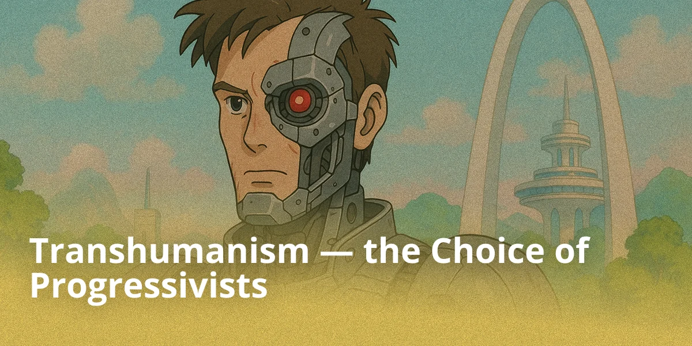
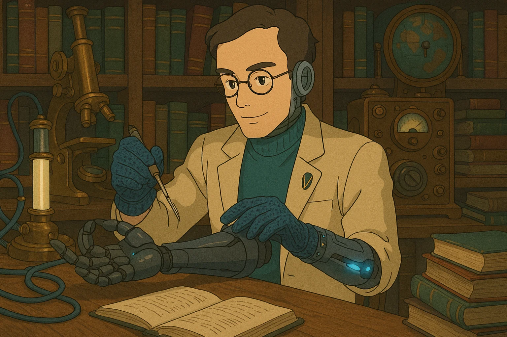
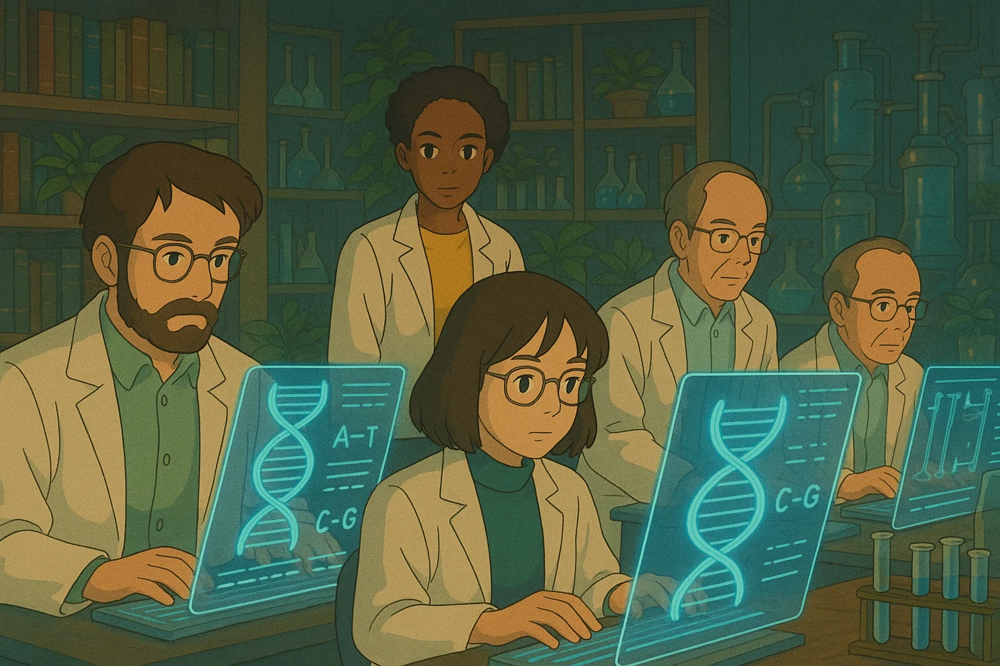
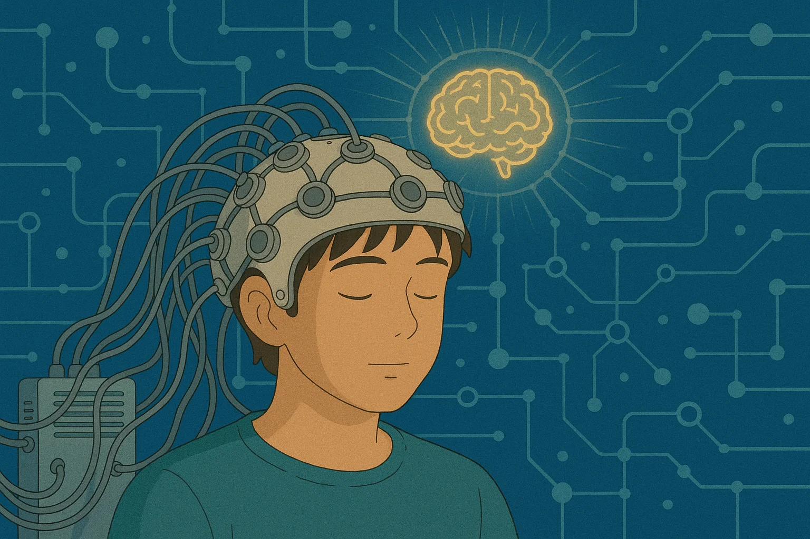
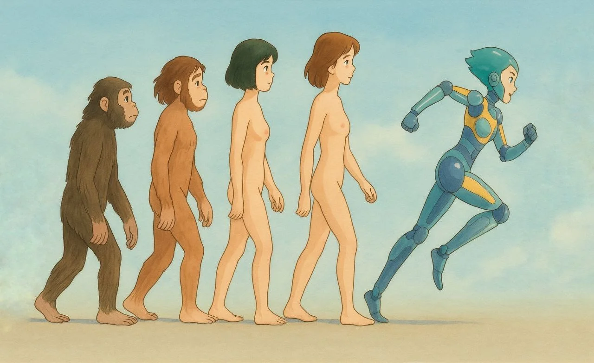
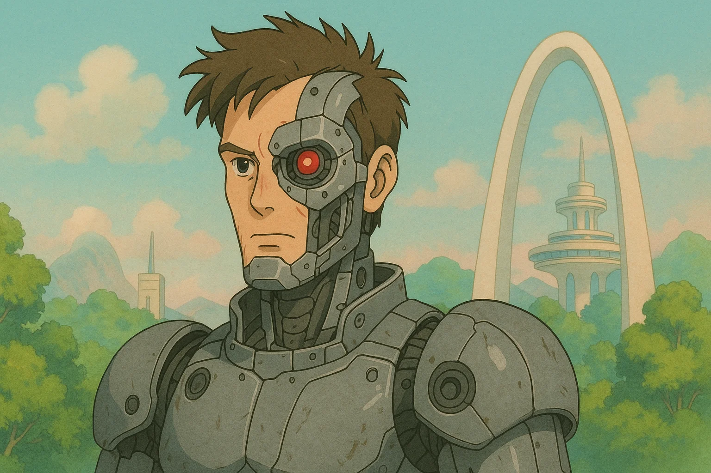

## Introduction

Transhumanism is a philosophical and scientific movement advocating for the radical improvement of human beings using advanced technologies.

From genetic engineering to neural interfaces, transhumanists believe that science is capable of overcoming biological limitations, such as aging, disease, and even mortality. Originating in the 20th century, this concept is gaining popularity in the era of rapid development of artificial intelligence and biotechnology. Today, transhumanism evokes both excitement and fierce debate: some see it as a path to utopia, others as a threat to human nature.

This article explores the key ideas of transhumanism and its technological prospects. Is humanity ready to step beyond its nature?

## Key Ideas of Transhumanism

### Human Improvement Through Technology

Transhumanism begins with a main premise: the human is not the limit. We are not obliged to remain as nature created us. If it is possible to be smarter, healthier, stronger — why not become so? Modern technologies are becoming an extension of our evolution, only now we are taking the controls ourselves.

One of the key areas of this progress is cyborgization — the integration of technological devices directly into the human body. Today, implants already allow restoring hearing, vision, controlling prosthetics with thoughts, and monitoring the body's state in real-time. In the future, neural interfaces, artificial organs, and enhanced sensors will not be exceptions, but the norm, expanding the boundaries of our capabilities as naturally as glasses or smartphones once did.

In the future, a deep integration with technology awaits us: neural interfaces, artificial organs, and perception-enhancing sensors. The cyborg human ceases to be science fiction — it is the next logical step. We no longer just adapt to the surrounding world; we transform ourselves to step outside biological existence.

These views are held by cyborg transhumanists who seek to enhance body and mind using technology today.

### Overcoming Biological Limitations

Aging, disease, death — for centuries, humans perceived them as an inevitable fate. But transhumanism challenges the very idea of finality. Why should we put up with the degradation of the body? Why is death a norm, and not a technical error of evolution?

This is where immortalism comes into play — a worldview asserting that death is not inevitable. This is not a philosophical metaphor, but a practical goal: extending life up to immortality. Immortalists are convinced that if aging is a disease, then it can be cured. And if death is a glitch, then it can be bypassed.

Today, science is already looking for ways to stop cellular aging, clear the body of accumulated molecular debris, and restart regeneration mechanisms. CRISPR (clustered regularly-interspaced short palindromic repeats) allows editing genes, not just treating diseases, but preventing them even before birth. Personalized medicine, cell therapy, nanorobots in the blood — this is not a fantasy, but the first steps to radical life extension.

For transhumanists, the finality of the biological body is not a sentence, but a challenge. And the more powerful technologies become, the closer humanity comes to the moment when dying in the old-fashioned way will not be the norm, but a conscious choice.

These ideas are developed by immortalist transhumanists who consider immortality a realistic scientific goal.

### The Concept of Singularity and Artificial Intelligence

Technological singularity is not a threat, but a long-awaited leap in the development of intelligence. It is the moment when artificial intelligence gains the ability to self-improve and helps us solve problems that seem impossible today. Instead of fear, there is hope: singularity opens the doors for humanity to a new era of prosperity, knowledge, and unprecedented opportunities.

AI is already helping us find cures, manage complex systems, predict the climate, and automate routine. But this is just the beginning. In the future, artificial intelligence will become our partner in thinking, creativity, and scientific discoveries. It will not replace humans — it will enhance us, becoming an extension of our will, our mind, our dream of a better world.

For transhumanists, singularity is a path to stepping beyond limits. It is a chance to merge biological and machine intelligence, overcoming diseases, death, and ignorance. We stand on the threshold of a great unification of the human desire for knowledge and the precision of machine logic. And if we are brave and wise enough, this future will become the brightest in all of human history.

These views are shared by singularitarian transhumanists, focused on the development of artificial intelligence and neuro-integration.

## Technologies of Transhumanism

Having studied the key ideas and directions of transhumanism, we can move on to consider the technologies that it promotes and considers fundamental to the human future:

- **Artificial Intelligence (AI)** — one of the key technologies of the future. The start of using tools was a catalyst for human evolution, leading to the creation of machines and automation of labor. Today, AI performs a similar revolution in the field of mental labor. Right now, Narrow AI processes colossal datasets, makes decisions, and even creates works of art. In the future, the development of General AI (AGI) and then ASI (Artificial Superintelligence) can lead to the emergence of mind significantly superior to human. AI will not only serve humans, but will also become their partner, mentor, friend, and possibly part of their personality through neural interfaces and cognitive implants.

- **Robots** ensure the deployment of AI in the physical world. With the development of sensors, autonomous navigation, and tactile feedback, robots will perform an increasingly wide range of tasks: from caring for the elderly to colonizing space. From tiny MEMS (microelectromechanical systems) to autonomous drones and robotic production complexes — they will become ubiquitous. Their number is expected to exceed the population of humans and animals.

- **Cyborgs** — the result of merging human with machines. Today, bionic prosthetics restore lost functions, and exoskeletons enhance physical capabilities. In the future, neural interfaces (such as Neuralink), implants for improving memory and attention, retinal prosthetics, and "smart" organs connected to the Internet of Things (IoT) will be widely used. The phenomenon of "augmented humans" — people with expanded cognitive and sensory capabilities — will emerge.

- **Genetic Engineering** — the key to controlling biological nature. With CRISPR-Cas9, Prime Editing, and TALEN, it is possible to edit DNA precisely, correcting genetic mutations and enhancing desired traits. Today, gene therapy treats rare diseases, and in the future, we will be able to increase intelligence, endurance, and resistance to viruses. Genomic programming of the future will make the creation of "designer babies" and directed evolution accessible.

- **Life Extension** is becoming a task of biotechnology, attracting the attention of major corporations and institutes. Telomerase activators, senolytics (drugs to remove "zombie cells"), epigenome editing, NAD+ restoration technology, and even cell rejuvenation using Yamanaka factors are being used. Cell therapy, organoid technologies, and 3D organ printing are on the way to a real fight against aging.

- **Immortality** — the goal that transhumanists set for science. Today we know that aging is not an obligatory biological process, but one susceptible to engineering. Damage can be treated, organs replaced, and the body restored with the help of nanomedicine. The possibility of "biological immortality" is becoming increasingly realistic — both through radical life extension and through digital forms of existence.

- **Cryonics** — a bet on the future. Preserving bodies and brains in a state of suspended animation using vitrification, cryonics proponents expect that future technologies (such as nanomedicine and molecular regeneration) will be able to bring a person back to life, not just reviving the body, but also restoring their consciousness.

- **Nanotechnologies** will open absolute control over matter. With the help of molecular assemblers, it will be possible to create any objects with atomic precision. In medicine, this will lead to the creation of nanobots capable of repairing cells, killing cancer tumors, and cleaning blood vessels. In industry — to highly efficient and cheap manufacturing.

- **Economy of Abundance** will become possible due to automation, nanotechnology, and AI. The principles of post-scarcity economy imply the elimination of deficits and reduction of cost to zero. The concepts of labor, property, and distribution will be rethought. Decentralized automatic resource management systems (DAOs) will appear, replacing traditional markets and states.

- **Cognitive Science** will make humans the masters of their consciousness. Research in neuroplasticity, optogenetics, transcranial magnetic stimulation (TMS), and BCI (brain-computer interface) will allow modifying thinking, accelerating learning, eliminating psychiatric disorders, and enhancing intelligence. Personalized neuro-profiles will appear, allowing precise tuning of the mental state for specific tasks.

- **Paradise Engineering** — a project of radical happiness. David Pearce and his followers propose eliminating suffering on a biological level. Using genetic engineering, psychopharmacology, neuromodulation, and AI, humanity can get rid of pain, fear, depression and create a stable state of well-being — not temporary, but baseline.

- **Mind Uploading** will open the possibility of transitioning to a non-material form of existence. This can occur by scanning and emulating the brain (Whole Brain Emulation), as well as through synthetic reconstruction of consciousness. Uploading will open the path to digital immortality, mind cloning, collective metaconsciousness, and superintelligence uniting billions of individual personalities.

- **Singularity** — the predicted moment when the pace of technological progress reaches such a speed and scale that human intelligence ceases to be the dominant form of mind on the planet. According to Ray Kurzweil, singularity will occur when artificial intelligence reaches the level of general intelligence (AGI) and then surpasses human, forming a superintelligence (ASI). This turning point will lead to exponential self-development of technologies, primarily AI, which will begin designing its own improved versions. From this moment on, progress will become autonomous and virtually unpredictable for human consciousness. Singularity will mark the beginning of the post-human era, in which the boundaries between human, machine, and information will disappear. Biological limits will be overcome using mind uploading, brain-computer interfaces, nanotechnology, and full control over matter. Humans will be able to exist in digital form, merge into mind collectives, and create virtual realities far exceeding in complexity anything that existed before. This stage will become not just a technological leap, but a transition to a new type of evolution — guided, conscious, infinite.

The evolutionary step containing the post-human.

All these technologies are not a fantasy, but a nascent reality. They shape the architecture of the future, in which humans cease to be a passive product of evolution and become its architect.

## The Future Through Transhumanism

The future to which transhumanism leads is not just a continuation of human history. It is a radical turning point. On the horizon are scenarios in which the familiar human disappears, giving way to a being with virtually limitless capabilities. We are looking towards singularity — the point where the speed of scientific and technological development goes beyond understanding, and artificial intelligence becomes more powerful than all human thought combined. Following it is a post-human society in which the mind ceases to be tied to the body, information flows directly between consciousnesses, and suffering and death recede into the past.

In this future, the question of who manages progress is especially important. Transhumanism is inherently close to libertarian values — freedom of choice, the inadmissibility of forced intervention in the body and mind, and the right to technological self-determination. The state here should not be a directive architect of the future, but it also cannot remain an outside observer. It must lift prohibitions on the research and application of transhumanist practices — from gene therapy to cryonics and neuroimplants.

But transhumanism does not guarantee paradise. Dystopian scenarios are also possible — where access to immortality is controlled by the elite, and inequality grows to cosmic scales. Where the state uses neurotechnology to control thinking, and genetic engineering solidifies castes. This line between utopia and dystopia is thin. That is why ethical guidance of scientific progress and open public dialogue about the future are important today.

Space is a natural continuation of the transhumanist agenda. Colonization of other planets is impossible without transforming the human itself. We face adaptation to Martian gravity, radiation, and resource deficits. The solutions lie in genetic modification, implants, exoskeletons, and digital interfaces. Transhumanism makes extraterrestrial expansion possible: not just humans, but updated post-humans capable of surviving in the most extreme conditions will go to the stars.

All over the world today, initiatives and organizations are forming that build the foundation of the future. Among them are Humanity+, the Immortality Foundation, Neuralink, OpenAI, the Singularity Institute, Lifespan.io, and the Methuselah Foundation. They conduct research, finance breakthrough projects, and lobby for the legalization of transhumanist practices. Their activity is proof that the future is being created right now, and anyone can become a participant.

Transhumanism is not a utopia, not a religion, and not a fashion. It is a strategy of survival and development of humanity in the XXI century and beyond. We have to decide whether we will become cybernetic immortal sages traveling through galaxies, or close the door to this future out of fear of changes.

## Conclusion

Transhumanism offers humanity a path of radical transformation — through technology, knowledge, and the will to progress. It is a philosophy connecting a scientific breakthrough with an eternal dream: to overcome disease, aging, and even death. But along with opportunities come serious challenges: the ethics of intervention in human nature, the preservation of personal and cultural identity.

As Ray Kurzweil said: "Technology is the extension of our mind and body. It makes us more human, not less." It is on our choice that it depends whether this path will become a road to a bright future or a source of new conflicts. Already today it is necessary to openly discuss what kind of world we want to see tomorrow.
