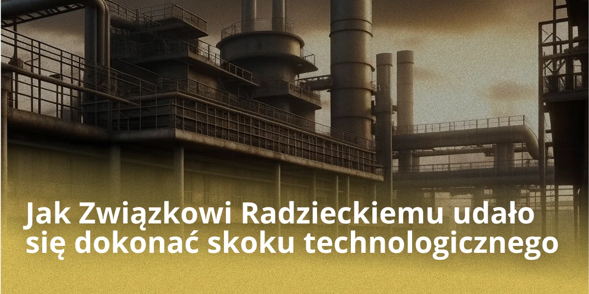
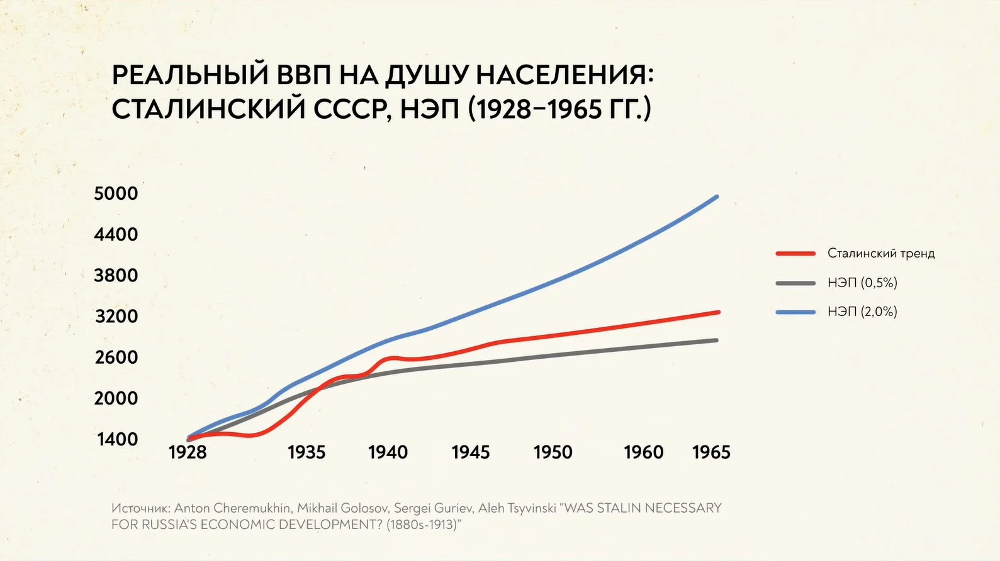
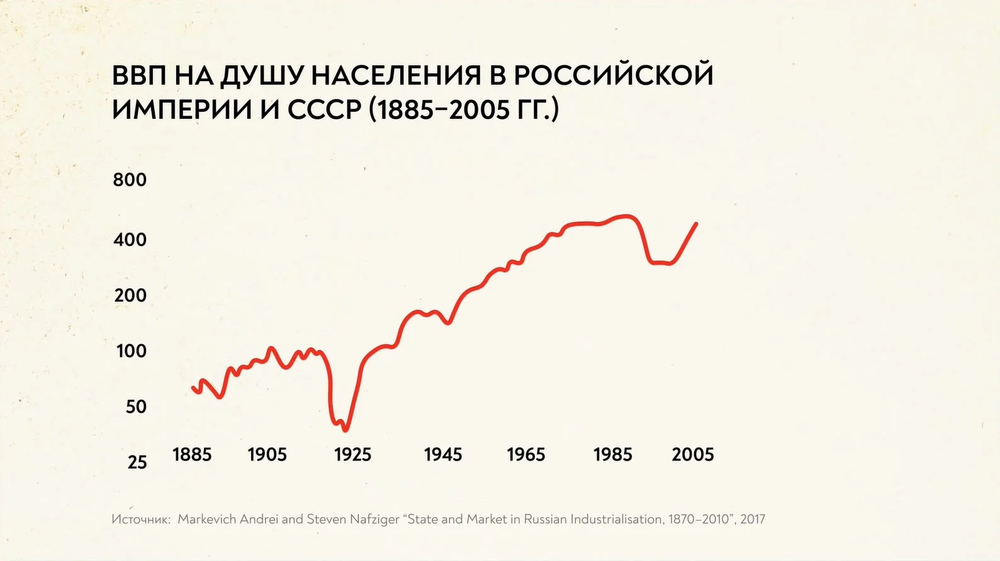

## Wprowadzenie

### Aktualność tematu

Aktualność tego badania wynika z konieczności zrozumienia przez społeczność naukową narzędzi, za pomocą których ZSRR dokonał skoku technicznego, jaką rolę odegrał on w odbudowie gospodarki do poziomu Imperium Rosyjskiego w przededniu rewolucji, a także zbadania roli kapitału zagranicznego i technologii w latach 30.-50. w gospodarce i przemyśle ZSRR.

### Obiekt i przedmiot badania

Obiekt badania — ZSRR.

Przedmiot badania — dokonywanie skoku technicznego w porewolucyjnej Rosji.

### Cel badania

Celem niniejszej pracy jest ustalenie przyczyn skoku technologicznego ZSRR w latach 30.-50. XX wieku, a także ustalenie stosowanych przy tym narzędzi.

## Przyczyny skoku technologicznego

Podstawą działań, które przyczyniły się do ożywienia technologicznego i gospodarczego do poziomu Rosji przedrewolucyjnej, było uświadomienie sobie przez rząd znacznego opóźnienia gospodarki radzieckiej w stosunku do krajów zachodnich.

## Wstęp

Przełom technologiczny wiąże się z procesem uprzemysłowienia (industrializacji) wdrożonym w ZSRR na początku XX wieku. Industrializacja to proces przyspieszonego przejścia społeczno-gospodarczego od stadium tradycyjnego do przemysłowego, z dominacją produkcji przemysłowej w gospodarce.

## Główna część

Na początku lat 30. kierownictwo ZSRR na czele ze Stalinem podjęło decyzję o stworzeniu w kraju silnego przemysłu ciężkiego jako podstawy gospodarki socjalistycznej, kompleksu wojskowo-przemysłowego i sektora paliwowo-energetycznego, rozwoju transportu (zwłaszcza samochodowego i lotniczego) oraz budowy ciągników jako bazy technicznej dla kolektywizacji wsi. Kierownictwo kraju wychodziło z założenia, że duże, wysoce wydajne przedsiębiorstwa szybciej i pełniej zaspokajają potrzeby gospodarki narodowej, a także są łatwiejsze do kontrolowania z centrum i pozwalają na likwidację pozostałości tradycyjnego systemu wielostrukturowego — rzeszy drobnych rzemieślników.

Plan pierwszej pięciolatki był realizowany w latach 1928-1932. W trakcie jego realizacji rozpoczęto wiele budów — UralMasz, ZIS i inne. Pierwszą pięciolatkę udało się zrealizować w cztery lata, co zainspirowało robotników. Plan zakładał rozwój elektroenergetyki — w ciągu 15 lat należało wybudować 30 elektrowni.

Druga pięciolatka rozpoczęła się w 1933 roku, a zakończyła w 1937 roku. Ludzie pracowali na trzy zmiany, kierowani chęcią realizacji wspólnej idei. W tym okresie zmienił się model industrializacji. Nacisk kładziono teraz nie na ilość, lecz na jakość. Znane stały się takie postacie jak Stachanow, Busygin, Czkałow i inni.

Trzecia pięciolatka rozpoczęła się w 1938 roku, ale została przerwana w 1941 roku z powodu wybuchu wojny. Głównym zadaniem tego etapu była konieczność dogonienia i wyprzedzenia krajów Zachodu w produkcji na mieszkańca. Planowano to osiągnąć poprzez redukcję wydatków na kompleks wojskowo-przemysłowy.

Szybko rozwijający się i przebudowujący swoją bazę materialno-techniczną przemysł zmienił swoją strukturę wewnętrzną w oparciu o gwałtowny wzrost przemysłu ciężkiego i powstawanie nowych gałęzi produkcji.

Na tej podstawie rozpoczęto socjalistyczną rekonstrukcję, której efektem było stworzenie nowoczesnego, zaawansowanego przemysłu, rekonstrukcja rolnictwa, zakończenie budowy fundamentów gospodarki socjalistycznej, a tym samym zapewnienie budowy bezklasowego społeczeństwa socjalistycznego podczas realizacji kolejnej pięciolatki.

O skali roli odbudowy, jaką przemysł wziął na siebie w gospodarce narodowej ZSRR, świadczy m.in. ilość dóbr materialnych, które przemysł przekazał krajowi w latach pięciolatki i które był w stanie dostarczyć pod jej koniec.

Przemysł metalurgiczny rozwiązywał zadania zaopatrzenia w metal przemysłu maszynowego. Udział budowy maszyn i metalurgii w zużyciu wyrobów walcowanych wzrósł z 47,9% w roku 1926/27 do 68,1% w roku 1929/30 i ponad 71% w latach 1931 i 1932.

Rola przemysłu w zaopatrywaniu kraju w zaawansowaną technikę szczególnie wzrosła. Przemysł wywarł rewolucyjny wpływ na całą strukturę produkcji. Jednocześnie z roku na rok rośnie zdolność przemysłu do dostarczania ciągników rolnictwu. Na przykład, podczas gdy rolnictwo otrzymało ponad 153,9 tys. ciągników w ciągu czterech i ćwierci roku, w samym 1932 roku przemysł ZSRR dostarczył 50 tys. ciągników. Produkcja wszystkich maszyn rolniczych w 1932 roku była ponad 5,5 raza wyższa niż w roku 1927/28.

## Kapitał zagraniczny

Rozwiązanie tych problemów z pomocą Zachodu — w formie inwestycji (poprzez udzielanie koncesji) lub płatnej pomocy technicznej — było jedynym wyjściem. Kilka lat po zakończeniu Nowej Polityki Ekonomicznej (NEP) zaprzestano udzielania koncesji. Podczas gdy import maszyn i urządzeń trwał nadal, rozwijały się inne relacje z firmami zachodnimi, zapoczątkowane w okresie NEP.

Próby projektowania i budowy dużych, skomplikowanych technicznie przedsiębiorstw nie powiodły się. Pierwszy radziecki projekt Magnitogorskiego Kombinatu Metalurgicznego, budowa Stalingradzkiej i Czelabińskiej Fabryki Traktorów, Swirskiej Elektrowni Wodnej itp. zakończyły się niepowodzeniem. Główną przyczyną były dyrektywy nakazujące zwiększanie rozmiarów przedsiębiorstw i ich pilne oddawanie do użytku. Pierwszy i drugi plan pięcioletni miały na celu stworzenie najnowocześniejszych kapitałochłonnych branż przemysłu lotniczego, samochodowego, traktorowego, chemicznego, maszynowego, elektrotechnicznego i pokrewnych, a także rozmieszczenie przemysłu na wschód i południe od Uralu. Do 1933 roku należało wybudować i zrekonstruować około 1500 obiektów.

Pomoc techniczna była świadczona w ramach specjalnych umów lub włączana do kontraktów na dostawę sprzętu. Były one znacznie krótsze niż koncesje i bardziej atrakcyjne dla firm zagranicznych, ponieważ nie wymagały ryzykownych inwestycji. W okresie Wielkiego Kryzysu lat 30. firmy zachodnie odczuwały zwiększone zapotrzebowanie na duże zamówienia, a ZSRR zyskał możliwość szybkiego opanowania zaawansowanych technologii i umiejętności produkcyjnych.

Dnieprowska Elektrownia Wodna została zbudowana według projektu radzieckiego, ale przy udziale amerykańskiej firmy Cooper Engineering i niemieckiej firmy Siemens jako konsultantów. Największe w Europie fabryki traktorów (Stalingradzka, Charkowska i Czelabińska), Magnitogorski Kombinat Metalurgiczny i Niżnonowogrodzka (Gorkowska) Fabryka Samochodów zostały zbudowane na wzór amerykański i były pochodzenia amerykańskiego. Partnerami zagranicznymi Związku Radzieckiego zostały firmy Albert Kahn, Inc., Ford Motor Company, International General Electric, International Harvester, Radio Corporation of America.

Według danych krajowych, w latach 1923-1933 w branżach przemysłu ciężkiego ZSRR zawarto 170 umów o pomocy technicznej: 73 z firmami niemieckimi, 59 z amerykańskimi, 11 z francuskimi, 9 ze szwedzkimi i 18 z firmami z innych krajów. Nie jest możliwe określenie, czyja pomoc była decydująca, ponieważ wiele projektów budowlanych miało charakter międzynarodowy. Na przykład zjednoczenie "Wostokostal" podpisało umowę z amerykańską firmą Arthur McKee na stworzenie planu generalnego kombinatu w Magnitogorsku, z niemiecką firmą Demag na projekt walcowni, a inna niemiecka firma zajęła się pracami wiertniczymi. Wszechzwiązkowe zjednoczenie chemiczne "Wsiechimprom" miało 20 umów z firmami z USA, Niemiec, Włoch, Francji, Norwegii, Szwecji, Szwajcarii itd.

Z różnych przyczyn 37 ze 170 kontraktów zostało rozwiązanych przedterminowo. Według ocen radzieckich, niektóre okazały się zbyt drogie, inne mało przydatne, a jeszcze inne nie mieściły się w pięcioletnim harmonogramie. W niektórych przypadkach baza produkcyjna okazała się niewystarczająca do zastosowania najnowszej technologii lub też zdołano ją opanować przed wygaśnięciem kontraktu. Zwiększenie zakresu prac wykonywanych przez Arthur McKee bez dodatkowego wynagrodzenia doprowadziło do zerwania kontraktu. Rozbieżności finansowe i inne uniemożliwiły firmie A.J. Brandt z Detroit dokończenie technicznej rekonstrukcji fabryki samochodów AMO w Moskwie. Można wskazać dwie okoliczności, które znacznie ograniczyły korzystanie z pomocy technicznej po 1933 roku. Po pierwsze, sukces samej industrializacji. Wiele nowych i zrekonstruowanych przedsiębiorstw rozpoczęło produkcję, a niektóre same stały się ośrodkami szkolenia i transferu technologii. Po drugie, ogromne koszty, które były ściśle kontrolowane przez Komisję Walutową Biura Politycznego, wpływającą na wszystkie decyzje o zakupach za granicą.

## Alternatywny punkt widzenia

Jeśli przeanalizujemy wykres długoterminowego rozwoju gospodarki rosyjskiej, stanie się jasne, że stalinowska industrializacja wcale nie była przełomem. Rzeczywisty wzrost gospodarczy w latach trzydziestych mieścił się w długoterminowych trendach rozwojowych kraju i zostałby osiągnięty przez Rosję również bez koszmaru rewolucji, kolektywizacji i pracy więźniów Gułagu.

W 2013 roku grupa ekonomistów opublikowała badanie, według którego nawet przy najbardziej niekorzystnym tempie rozwoju, NEP przyniósłby sukcesy podobne do wyników przyspieszonej industrializacji. Okazało się, że na początku lat 40. kraj osiągnąłby prawie taki sam PKB na mieszkańca, jaki był w rzeczywistym Związku Radzieckim. A gdyby reformy rynkowe zostały rozszerzone pod koniec lat 20., PKB na mieszkańca mógłby przewyższyć wskaźnik stalinowski.

Aby doprowadzić do redystrybucji siły roboczej ze wsi do miast, radzieckie kierownictwo nie podnosiło poziomu życia w miastach, lecz prowadziło duszącą politykę na wsi. Zakończyło się to narodową katastrofą — głodem w latach 1932-1933, w wyniku którego zginęło 7 milionów ludzi.

## Podsumowanie

Kierownictwo ZSRR po śmierci Stalina znalazło się na rozdrożu. Podczas gdy reformy Malenkowa były bardziej liberalne, Chruszczow zmodyfikował kurs stalinowski.

Gwałtownie zwiększono wolumen inwestycji: na lata 1956-1959 zaplanowano inwestycje państwowe w wysokości 990 mld rubli; w ten sposób inwestycje w gospodarkę radziecką w ciągu tych trzech lat przewyższyły cały poprzedni plan pięcioletni opracowany za Stalina. Ponadto rozpoczęła się reforma zarządzania: wprowadzenie sowmarchozów.

Podsumowując powyższe, staje się jasne, jakie narzędzia zostały wykorzystane do stworzenia skoku przemysłowego i gospodarczego w ZSRR na początku XX wieku, a także pozwala to zrozumieć efektywność poszczególnych ogniw tego wielkiego łańcucha.

## Literatura

1. Cheremukhin, Anton and Golosov, Mikhail and Guriev, Sergei and Tsyvinski, Aleh and Tsyvinski, Aleh, Was Stalin Necessary for Russia's Economic Development? (September 2013). NBER Working Paper No. w19425, Available at SSRN: https://ssrn.com/abstract=2325798

2. Gregory, Paul R. Russian National Income, 1885-1913. Cambridge Univ. Press, 1982.

3. Markevich Andrey, Harrison Mark. Great War, Civil War, and Recovery: Russia's National Income, 1913 to 1928. The Journal of Economic History, Vol. 71, No. 3 (September 2011). ( https://www.nes.ru/files/Preprints-resh/WP146.pdf )

4. Borodkin, Gregory, "Russia’s Industrial Growth In the First Stage of Industrialisation (1880s-1913)" ( https://archive.org/details/borodkin_gregory/page/n9/mode/2up )

5. Alexander Gerschenkron (1947). Supplement: Economic Growth: A Symposium || The Rate of Growth in Russia: The Rate of Industrial Growth in Russia, Since 1885. The Journal of Economic History, 7(), 144–174.

6. Markevich Andrei. State and Market in Russian Industrialization, 1870–2010

7. Wykład NES: https://youtu.be/PczQgFV3C2w

8. Korchagina Sofya Ilyinichna, Cherepukhina Vasilisa Sergeevna, Chernyavskaya Ekaterina Nikolaevna SOCIO-ECONOMIC DEVELOPMENT OF THE USSR IN THE 1920s - 1930s (Dostęp: 13.12.2022).
