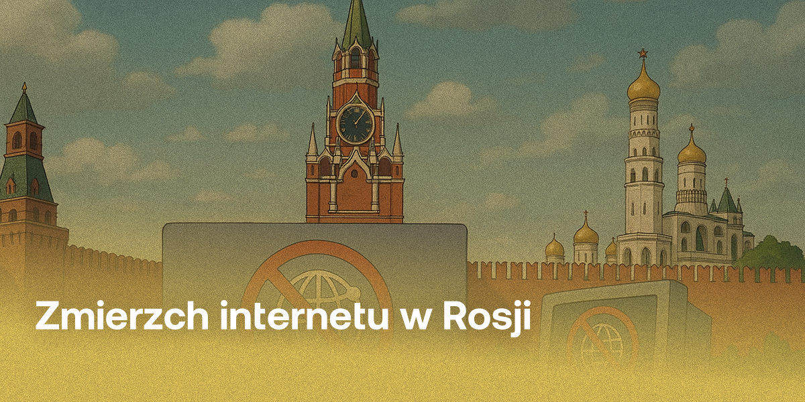

## Disclaimer

W tym artykule spróbujemy zajrzeć w przyszłość internetu na najbliższe pięć lat i dowiedzieć się, jakie zmiany pukają już do naszych cyfrowych drzwi. Jest to subiektywna ocena autora, w związku z czym możliwe są zarówno spory, jak i rozbieżności z rzeczywistym rozwojem wydarzeń, ale właśnie na tym polega sens prognozy i dyskusji publicznej.

## Izolacja rosyjskiego segmentu

W ciągu ostatnich czterech lat Rosja stopniowo przechodzi do wdrażania koncepcji cyfrowej suwerenności. W bliskiej perspektywie spodziewane jest faktyczne odłączenie krajowego segmentu internetu od sieci globalnej. Krok ten doprowadzi do zablokowania dostępu do zagranicznych zasobów, które odmówią współpracy z krajowymi strukturami bezpieczeństwa.

Obserwowane dziś masowe blokady zagranicznych platform stają się oczywistą częścią tego procesu. Coraz wyraźniej widać, że pełnią one funkcję przygotowania wstępnego — swego rodzaju treningu przed całkowitym przejściem do zamkniętego ekosystemu cyfrowego. W ten sposób stopniowo kształtuje się struktura zorientowana na usługi krajowe, kontrolowane i regulowane w krajowym porządku prawnym.

W Rosji kształtuje się model dostępu do internetu, w którym swobodne i anonimowe połączenie jest stopniowo wypierane przez system cyfrowej identyfikacji za pośrednictwem usług państwowych. Logowanie „na dowód” i przez aplikacje państwowe przestaje być scenariuszem hipotetycznym i coraz częściej jest opisywane jako prawdopodobny wektor rozwoju regulacji.

Do końca tej dekady trajektoria rozwoju rosyjskiego segmentu sieci z dużym prawdopodobieństwem doprowadzi do modelu koncepcyjnie zbliżonego do chińsko-północnokoreańskiego wariantu „internetu narodowego”. Mowa o transformacji dawniej globalnego i relatywnie otwartego środowiska w izolowany, ściśle filtrowany obieg z dominacją platform krajowych i kurczącą się przestrzenią dla niekontrolowanej komunikacji zewnętrznej.

## Jedyny punkt wejścia

Kluczowym ogniwem tego systemu jest infrastruktura portalu „Gosuslugi” i powiązanych z nim państwowych platform cyfrowych, w tym aplikacji regionalnych i nowych usług wbudowanych w ekosystem państwa elektronicznego. Aplikacja „Maks” przechodzi przez tę samą infrastrukturę: władze promują ją jako „narodowy komunikator”, faktycznie wbudowując ją w jeden pakiet państwowych kanałów cyfrowych. Już dziś kanały te są wykorzystywane nie tylko do świadczenia usług, ale także do wdrażania technicznych mechanizmów kontroli, co czyni je wygodnym „punktem montażowym” dla przyszłego modelu kontroli dostępu do sieci.

Bez konta w tych usługach po prostu nie będzie można zalogować się na konto Yandex ani do żadnej innej rosyjskiej usługi, gry czy aplikacji. W rzeczywistości brak takiego konta jest równoznaczny z odłączeniem od internetu — cyfrowe życie w Rosji staje się niemożliwe bez tej „przepustki”. Kształtuje się środowisko, w którym tożsamość cyfrowa stanowi główny mechanizm autoryzacji i dostępu do zasobów sieciowych.

Początkowo takie środki będą przedstawiane jako krok ku dobremu, w celu ochrony dzieci i bezpieczeństwa publicznego. Z czasem jednak nabiorą one masowego charakteru i dotkną wszystkich bez wyjątku.

## Państwowy bank biometrii

Kontynuując analizę możliwych scenariuszy rozwoju sytuacji w rosyjskim segmencie internetu, warto wspomnieć o zamiłowaniu państwa do biometrii obywateli. Powszechne stosowanie biometrii do identyfikacji w aplikacjach państwowych stanie się kluczowym elementem zunifikowanego systemu dostępu.

Państwowy Bank Biometrii, gromadzący dane milionów obywateli za pośrednictwem Jednolitego Rejestru Biometrycznego (EBR), już dziś pozycjonuje się jako hub infrastrukturalny do weryfikacji w cyfrowym ekosystemie. W scenariuszu izolacji Runetu baza ta ewoluuje w uniwersalną przepustkę: portal „Gosuslugi”, komunikator „Maks” i powiązane platformy będą wymagać skanowania twarzy lub głosu przy logowaniu, zastępując przestarzałe hasła ciągłym monitoringiem biometrycznym. Takie podejście nie tylko uprości autoryzację, ale również zapewni władzom pełną inwigilację: każda sesja, wyszukiwanie i transakcja będą powiązane z unikalnym profilem biometrycznym, co pozwoli na śledzenie zachowań obywateli w czasie rzeczywistym bez ich wiedzy.

Ekspansja biometrii dotknie nie tylko systemów państwowych, ale także prywatnych aplikacji zintegrowanych z infrastrukturą państwową: banków, usług dostawczych, portali korporacyjnych — wszystkie one zyskają „bramkę biometryczną” pod egidą EBR.

## Co już mamy? Celowe spowalnianie i odłączanie internetu

Już teraz władze dysponują takimi narzędziami i możliwościami, jak scentralizowane spowalnianie poszczególnych usług na poziomie operatorów telekomunikacyjnych: sztandarowym przykładem jest spowalnianie YouTube w latach 2024–2025 pod pretekstem „starzenia się serwerów” i konieczności zmniejszenia obciążenia infrastruktury, z ograniczeniem prędkości dla wideo o wysokiej rozdzielczości przy zachowaniu podstawowej sprawności treści tekstowych i audio.

Techniczną podstawą są narzędzia do analizy i filtrowania ruchu (DPI oraz wdrażane u operatorów systemy TSPU), przewidziane przez infrastrukturę i logikę ustawy o „suwerennym Runecie”, co pozwala na stosowanie wybiórczych ograniczeń bez formalnego „odłączania internetu”. Równolegle w 2025 roku zauważalne stały się praktyki punktowych, regionalnych wyłączeń mobilnego internetu pod pretekstem bezpieczeństwa i ochrony obiektów, co pokazuje gotowość systemu do pracy w trybie krótkotrwałych „blackoutów” w określonym regionie lub podczas wydarzeń.

## Nowe realia użytkowników

Jeśli zagraniczna firma nie jest zainteresowana rosyjskim rynkiem i ścisłą współpracą z organami państwowymi, uruchomienie aplikacji na terytorium FR staje się praktycznie niemożliwe, a znane sposoby obchodzenia blokad przestają działać. Jednak dla biznesu, który potrzebuje zasobów z takich „nieprzyjaznych” usług, służby specjalne są gotowe wydzielić osobną linię dostępu bez ogólnej blokady za pomocą wielkiego rosyjskiego firewallu. Tworzy to paradoksalną sytuację: pełna izolacja dla graczy niekontrolowanych, ale furtki dla „potrzebnych” pod ścisłym nadzorem.

Taka praktyka jest już obecnie szeroko rozpowszechniona w Rosji: prorządowe farmy botów i najwięksi giganci IT powszechnie korzystają z wydzielonych kanałów bez blokad, uzyskując dostęp do zagranicznych zasobów pod szczególną kontrolą. Pozwala to uniknąć ogólnych ograniczeń „wielkiego firewallu”, ale wymaga uzgodnienia z władzami i służbami specjalnymi.

Oto kilka przykładów tego, co można zrobić na początkowym etapie stosowania „piekielnego banhammera” do treści zagranicznych:

Pierwszym sposobem jest korzystanie z kart eSIM zagranicznych operatorów, na przykład francuskiego Orange lub estońskiego Bite. Kluczową zaletą tego podejścia jest uzyskanie europejskiego adresu IP bez konieczności korzystania z tradycyjnych narzędzi, takich jak VPN. Może to być szczególnie przydatne w przypadku uzyskiwania dostępu do zasobów zablokowanych geograficznie lub omijania lokalnych ograniczeń. Jednak rozwiązanie to ma istotne wady.

Po pierwsze, koszt połączeń eSIM pozostaje wysoki. Przykładowo pakiet danych o wielkości około 10 GB może kosztować użytkownika około 3000 rubli, co czyni go nieopłacalnym przy regularnym lub intensywnym użytkowaniu. Po drugie, rosyjscy regulatorzy aktywnie przeciwdziałają takim praktykom. Już teraz omawiane i wdrażane są środki blokowania zagranicznych kart SIM, w tym ich odłączanie po unikalnym identyfikatorze urządzenia — IMEI. Stwarza to realne zagrożenie utraty dostępu do usługi w dowolnym momencie.

W rezultacie karty eSIM od zagranicznych operatorów okazują się praktyczne tylko w ograniczonym zakresie: do wymiany wiadomości w komunikatorach, sprawdzania poczty elektronicznej lub prostego surfowania w sieci. W przypadku przesyłania strumieniowego wideo w wysokiej jakości, gier online lub innych aktywności wymagających znacznego transferu danych, opcja ta szybko staje się nieefektywna zarówno finansowo, jak i technicznie.

Tym samym, pomimo technologicznej elegancji eSIM i jej potencjału jako narzędzia cyfrowej wolności, na dzień dzisiejszy pozostaje ona raczej rozwiązaniem tymczasowym i wysoce wyspecjalizowanym, a nie długofalową alternatywą dla tradycyjnych metod dostępu do globalnego internetu.

Drugim, bardziej radykalnym, ale i droższym sposobem omijania krajowych ograniczeń cyfrowych jest korzystanie ze satelitarnego internetu Starlink. Technologia ta, opracowana przez firmę SpaceX, umożliwia użytkownikom bezpośrednie połączenie z siecią globalną za pośrednictwem konstelacji satelitów na niskiej orbicie okołoziemskiej, całkowicie omijając naziemną infrastrukturę telekomunikacyjną kontrolowaną przez rosyjskie organy regulacyjne, w tym Roskomnadzor.

Takie podejście faktycznie wyprowadza użytkownika „poza granice” krajowego segmentu internetu, zapewniając dostęp do niefiltrowanego ruchu globalnego. Cena za tę wolność pozostaje jednak wysoka: zestaw sprzętu na tzw. „szarym” rynku kosztuje około 60 tysięcy rubli. Ponadto samo działanie systemu wymaga otwartego nieba i stosunkowo wolnej przestrzeni, co nie zawsze jest możliwe w warunkach miejskich.

Jednak główne trudności wiążą się nie tylko z kwestiami technicznymi i finansowymi. Korzystanie ze Starlink w Rosji niesie ze sobą poważne ryzyko prawne. Oficjalnie usługa nie jest licencjonowana na terytorium kraju, a próby obejścia ograniczeń geograficznych — na przykład poprzez fałszowanie współrzędnych GPS — mogą być kwalifikowane jako naruszenie prawa. W szczególności art. 238 Kodeksu Karnego Federacji Rosyjskiej przewiduje odpowiedzialność za nielegalne korzystanie ze środków łączności, w tym łączności satelitarnej, co potencjalnie grozi ściganiem karnym.

Poza aspektami prawnymi użytkowników czekają trudności praktyczne: niestabilność sygnału podczas deszczu lub śniegu, możliwe przerwy spowodowane zakłóceniami atmosferycznymi lub chwilowym brakiem satelitów w polu widzenia. Sprawia to, że Starlink nie zawsze jest niezawodnym rozwiązaniem do codziennego użytku, zwłaszcza w regionach o zmiennym klimacie.

Mimo wysokich kosztów, niepewności prawnej i ograniczeń technicznych, internet satelitarny pozostaje jednym z najskuteczniejszych sposobów na uzyskanie niezależnego dostępu do globalnej sieci. Dla tych, którzy są gotowi podjąć związane z tym ryzyko i koszty, Starlink oferuje nie tylko alternatywę — oferuje wyjście poza cyfrowe granice państw.

Trzecim, i chyba najbardziej nietypowym sposobem omijania ograniczeń cyfrowych, jest stosowanie tuneli LoRa. Technologia ta opiera się na falach radiowych niskiej częstotliwości (w zakresie około 868 MHz w Europie i Rosji) oraz niedrogich mikrokontrolerach, takich jak ESP32 czy Heltec. W przeciwieństwie do tradycyjnych połączeń przewodowych lub komórkowych, LoRa (Long Range) umożliwia przesyłanie danych na znaczne odległości przy skrajnie niskim zużyciu energii, ale za cenę bardzo skromnej prędkości — zaledwie około 250 bitów na sekundę.

Niemniej jednak ta „powolność” jest kompensowana elastycznością architektury. Użytkownicy mogą łączyć się w zdecentralizowane sieci mesh, w których każdy węzeł przekazuje ruch dalej w łańcuchu. Wyobraźmy sobie: jedna osoba wysyła zaszyfrowaną wiadomość do swojego sąsiada, ten do kolejnego i tak dalej, aż pakiet dotrze do węzła z pełnym dostępem do globalnego internetu (na przykład przez zagraniczny VPN). W ten sposób, nawet w warunkach całkowitej blokady tradycyjnych kanałów łączności, społeczność może utrzymać podstawową wymianę informacji.

Podejście to jest szczególnie atrakcyjne ze względu na odporność na scentralizowaną kontrolę: sieć nie ma jednego punktu awarii, a jej sprzęt jest kompaktowy, niedrogi i trudny do wykrycia. Technologia ta ma jednak poważne ograniczenia.

Przepustowość sieci jest tak niska, że nadaje się ona jedynie do przesyłania wiadomości tekstowych, krótkich komend lub zaszyfrowanych metadanych, podczas gdy wideo, audio i strony internetowe z obrazami wykraczają poza jej możliwości. Ponadto autonomiczność urządzeń pozostaje ograniczona: nawet przy oszczędnym zużyciu energii baterie szybko się rozładowują podczas aktywnej retransmisji. Dodatkowym problemem jest podatność sygnału na zakłócenia radiowe, ekranowanie przez budynki oraz celowe zagłuszanie, zwłaszcza w środowisku miejskim.

Mimo tych wad, tunele LoRa stanowią intrygujący przykład „cyfrowego oporu”. Nie są przeznaczone do codziennego surfowania, ale mogą stać się kanałem ratunkowym w ekstremalnych warunkach, czy to w przypadku masowych przerw w łączności, cenzury, czy sytuacji kryzysowych. W tym sensie LoRa nie zastępuje internetu, lecz jest jego awaryjnym odpowiednikiem: wolnym, kruchym, ale wolnym.

## Podsumowanie

W kontekście gwałtownego nasilania się izolacji cyfrowej i wdrażania mechanizmów państwowego filtrowania, rosyjski internet wkracza w fazę wewnętrznego zamknięcia. Technologie omijania cenzury, czy to VPN, proxy czy sieci rozproszone, pozostają tymczasowym narzędziem oporu, a nie trwałym rozwiązaniem. W miarę rozwoju mechanizmów blokowania ich cykl życia nieuchronnie się skraca, zamieniając się w dynamiczny wyścig między deweloperami a cenzurą. Równolegle nasila się trend ku obowiązkowej identyfikacji, w tym rozszerzaniu scenariuszy biometrycznych za pośrednictwem platform państwowych i powiązanych z nimi usług: biometria działa tutaj nie tylko jako sposób na „wygodne logowanie”, ale także jako dźwignia infrastrukturalna powiązująca dostęp do usług cyfrowych ze zweryfikowaną osobą.

Jednak sama konieczność stosowania takich technologii wskazuje na fundamentalną sprzeczność: próba kontrolowania globalnej przestrzeni komunikacji jest skazana na ciągłe pojawianie się nowych form jej omijania. Dlatego pytanie brzmi dziś nie o to, czy uda się całkowicie odciąć kanały cyfrowe, ale o to, jak głęboka stanie się normalizacja reżimu kontrolowanego dostępu, w którym anonimowość jest wypierana przez połączenie filtrowania sieci, identyfikacji cyfrowej i weryfikacji biometrycznej.
