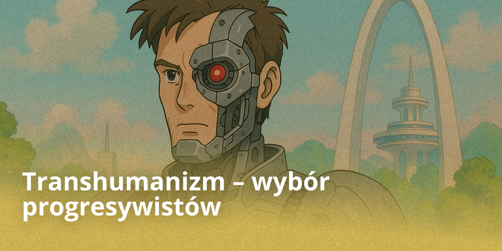
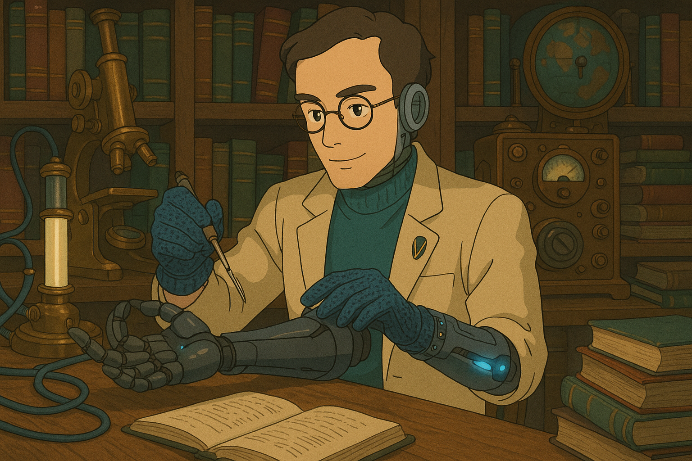
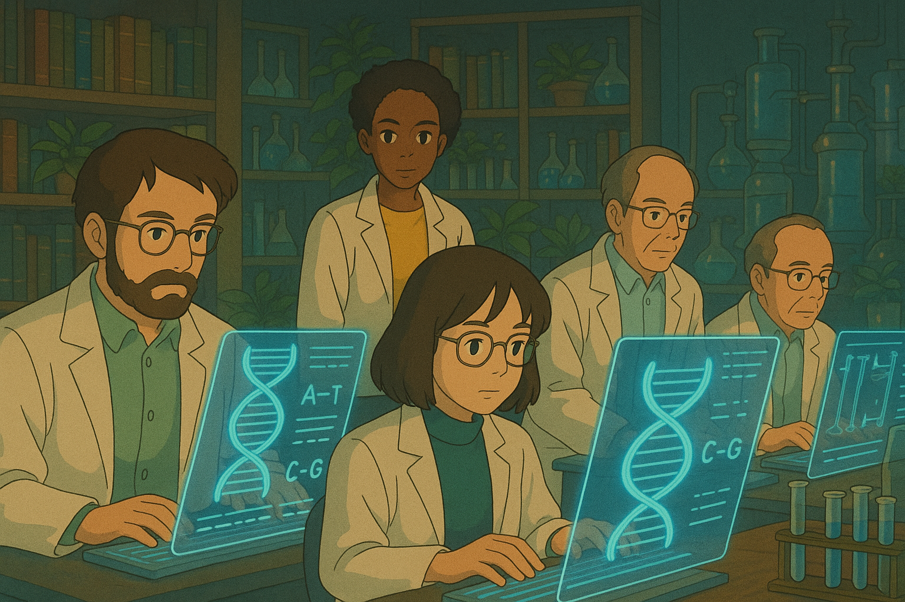
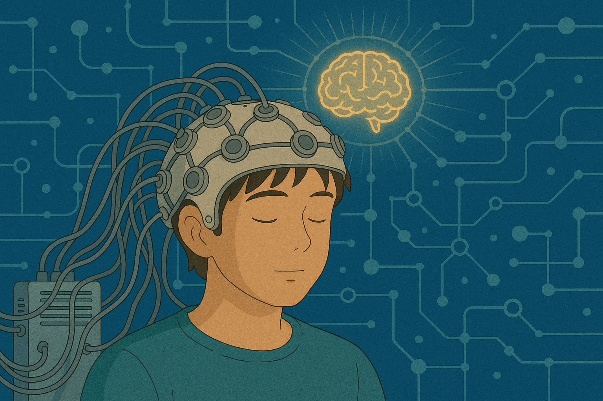
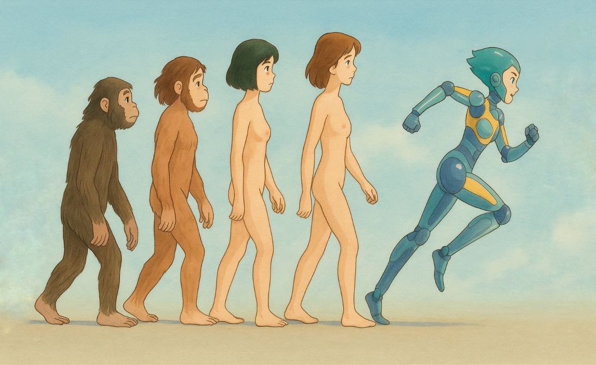
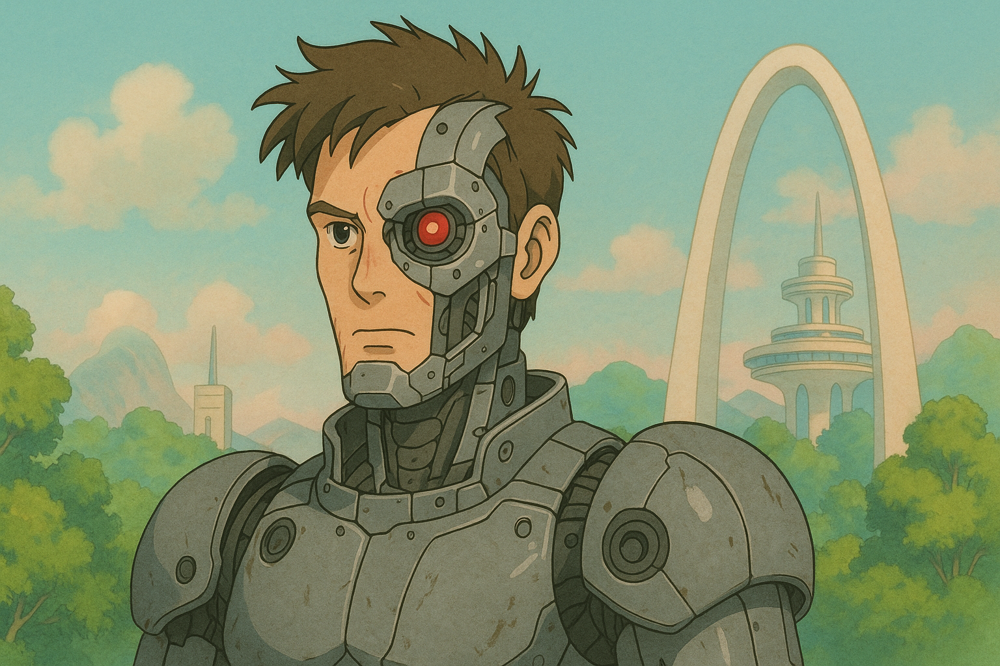

## Wprowadzenie

Transhumanizm to ruch filozoficzny i naukowy opowiadający się za radykalnym ulepszeniem człowieka za pomocą zaawansowanych technologii.

Od inżynierii genetycznej po neurointerfejsy, transhumaniści wierzą, że nauka jest w stanie przezwyciężyć biologiczne ograniczenia, takie jak starzenie się, choroby, a nawet śmiertelność. Narodzona w XX wieku koncepcja zyskuje na popularności w erze szybkiego rozwoju sztucznej inteligencji i biotechnologii. Dziś transhumanizm budzi zarówno zachwyt, jak i zażarte spory: jedni widzą w nim drogę do utopii, inni — zagrożenie dla ludzkiej istoty.

Ten artykuł bada kluczowe idee transhumanizmu i jego perspektywy technologiczne. Czy ludzkość jest gotowa wyjść poza granice swojej natury?

## Kluczowe idee transhumanizmu

### Ulepszenie człowieka przez technologie

Transhumanizm zaczyna się od głównego przesłania: człowiek to nie granica. Nie musimy pozostać takimi, jakimi stworzyła nas natura. Jeśli można być mądrzejszym, zdrowszym, silniejszym — dlaczego by takimi nie zostać? Nowoczesne technologie stają się przedłużeniem naszej ewolucji, tyle że teraz sami przejmujemy stery.

Jednym z kluczowych kierunków tego postępu jest cyborgizacja — wdrażanie urządzeń technologicznych bezpośrednio do ludzkiego ciała. Już dziś implanty pozwalają przywracać słuch, wzrok, sterować protezami za pomocą myśli i monitorować stan organizmu w czasie rzeczywistym. W przyszłości interfejsy neuronowe, sztuczne narządy i wzmocnione sensory staną się nie wyjątkiem, lecz normą, poszerzając granice naszych możliwości tak samo naturalnie, jak kiedyś zrobiły to okulary czy smartfony.

W przyszłości czeka nas głęboka integracja z technologią: neurointerfejsy, sztuczne narządy, sensory wzmacniające percepcję. Człowiek-cyborg przestaje być fantastyką — to kolejny logiczny krok. Nie tylko dostosowujemy się do otaczającego świata; transformujemy siebie, aby wyjść poza biologiczne istnienie.

Poglądy te podzielają cyborg-transhumaniści, którzy dążą do wzmocnienia ciała i umysłu za pomocą technologii już dziś.

### Przezwyciężanie biologicznych ograniczeń

Starzenie się, choroby, śmierć — przez długie wieki człowiek postrzegał je jako nieuchronny los. Jednak transhumanizm rzuca wyzwanie samej idei skończoności. Dlaczego mamy godzić się z degradacją ciała? Dlaczego śmierć jest normą, a nie błędem technicznym ewolucji?

Tutaj wkracza immortalizm — światopogląd twierdzący, że śmierć nie jest nieunikniona. To nie metafora filozoficzna, lecz praktyczny cel: przedłużanie życia aż do nieśmiertelności. Immortaliści są przekonani, że jeśli starzenie się jest chorobą, to można je wyleczyć. A jeśli śmierć jest usterką, to można ją obejść.

Dziś nauka szuka już sposobów na zatrzymanie starzenia się komórek, oczyszczenie organizmu z nagromadzonych odpadów molekularnych i ponowne uruchomienie mechanizmów regeneracji. CRISPR pozwala na edycję genów, co pozwala nie tylko leczyć choroby, ale zapobiegać im jeszcze przed narodzeniem. Medycyna personalizowana, terapia komórkowa, nanoroboty we krwi — to nie fantazja, lecz pierwsze kroki do radykalnego przedłużenia życia.

Dla transhumanistów skończoność biologicznego ciała to nie wyrok, lecz wyzwanie. Im potężniejsze stają się technologie, tym bliżej ludzkość podchodzi do momentu, w którym umieranie w tradycyjny sposób przestanie być normą, a stanie się świadomym wyborem.

Idee te rozwijają transhumaniści-immortaliści, uważający nieśmiertelność za realny cel naukowy.

### Koncepcja osobliwości i sztuczna inteligencja

Osobliwość technologiczna to nie zagrożenie, lecz długo oczekiwany skok w rozwoju umysłu. To moment, w którym sztuczna inteligencja zyska zdolność do samodoskonalenia i pomoże nam rozwiązywać zadania, które dziś wydają się niemożliwe. Zamiast strachu pojawia się nadzieja: osobliwość otwiera przed ludzkością drzwi do nowej ery dobrobytu, wiedzy i bezprecedensowych możliwości.

AI pomaga nam już w znajdowaniu leków, zarządzaniu złożonymi systemami, prognozowaniu klimatu i automatyzacji rutyny. Ale to dopiero początek. W przyszłości sztuczna inteligencja stanie się naszym partnerem w myśleniu, twórczości i odkryciach naukowych. Nie zastąpi człowieka — wzmocni nas, stając się przedłużeniem naszej woli, naszego umysłu, naszego marzenia o lepszym świecie.

Dla transhumanistów osobliwość to droga do wyjścia poza ograniczenia. To szansa na połączenie inteligencji biologicznej i maszynowej, przezwyciężenie chorób, śmierci i ignorancji. Stoimy na progu wielkiego zjednoczenia ludzkiego dążenia do wiedzy i precyzji maszynowej logiki. Jeśli będziemy wystarczająco odważni i mądrzy, ta przyszłość stanie się najjaśniejszą w całej historii ludzkości.

Poglądy te podzielają transhumaniści-singularyści, skoncentrowani na rozwoju sztucznej inteligencji i neurointegracji.

## Technologie transhumanizmu

Po zapoznaniu się z kluczowymi ideami i kierunkami transhumanizmu możemy przejść do rozważenia technologii, które promuje i uważa za fundamentalne dla przyszłości człowieka:

- **Sztuczna Inteligencja (AI)** — jedna z kluczowych technologii przyszłości. Początek korzystania z narzędzi był katalizatorem ludzkiej ewolucji, prowadząc do tworzenia maszyn i automatyzacji pracy. Dziś AI dokonuje podobnej rewolucji w obszarze pracy umysłowej. Już teraz wąska AI (Narrow AI) przetwarza kolosalne ilości danych, podejmuje decyzje i tworzy dzieła sztuki. W przyszłości rozwój ogólnej AI (AGI), a następnie ASI (sztucznej superinteligencji), może doprowadzić do powstania umysłu znacznie przewyższającego ludzki. AI będzie nie tylko służyć człowiekowi, ale stanie się jego partnerem, mentorem, przyjacielem, a być może i częścią jego osobowości poprzez interfejsy neuronowe i implanty poznawcze.

- **Roboty** zapewniają wdrożenie AI w świecie fizycznym. Wraz z rozwojem sensoryki, autonomicznej nawigacji i dotykowego sprzężenia zwrotnego roboty będą wykonywać coraz szerszy zakres zadań: od opieki nad osobami starszymi po kolonizację kosmosu. Od malutkich systemów MEMS po autonomiczne drony i zrobotyzowane kompleksy produkcyjne — staną się one powszechne. Oczekuje się, że ich liczba przewyższy populację ludzi i zwierząt.

- **Cyborgi** — wynik połączenia człowieka z maszynami. Już dziś protezy bioniczne przywracają utracone funkcje, a egzoszkielety wzmacniają możliwości fizyczne. W przyszłości masowo stosowane będą neurointerfejsy (np. Neuralink), implanty poprawiające pamięć i uwagę, protezy siatkówki oraz „inteligentne” narządy podłączone do Internetu Rzeczy (IoT). Pojawi się fenomen „ludzi augmentowanych” — osób o rozszerzonych możliwościach poznawczych i sensorycznych.

- **Inżynieria genetyczna** — klucz do kontroli nad naturą biologiczną. Za pomocą CRISPR-Cas9, Prime Editing i TALEN można precyzyjnie edytować DNA, korygując mutacje genetyczne i wzmacniając pożądane cechy. Już dziś terapia genowa leczy rzadkie choroby, a w przyszłości będziemy mogli zwiększać inteligencję, wytrzymałość i odporność na wirusy. Programowanie genomowe przyszłości udostępni tworzenie „dzieci projektowanych” i ewolucję kierowaną.

- **Przedłużanie życia** staje się zadaniem biotechnologii, przyciągając uwagę największych korporacji i instytutów. Stosowane są aktywatory telomerazy, senolityki — leki usuwające „komórki zombie”, edycja epigenomu, technologia przywracania NAD+ oraz odmładzanie komórek za pomocą czynników Yamanaki. Terapia komórkowa, technologie organoidowe i biodruk 3D narządów są u progu realnej walki ze starzeniem się.

- **Nieśmiertelność** — cel, jaki transhumaniści stawiają przed nauką. Już dziś wiemy, że starzenie się nie jest obowiązkowym procesem biologicznym, lecz poddającym się inżynierii. Uszkodzenia można leczyć, narządy wymieniać, a ciało regenerować za pomocą nanomedycyny. Możliwość „biologicznej nieśmiertelności” staje się coraz bardziej realistyczna — zarówno poprzez radykalne przedłużenie życia, jak i cyfrowe formy egzystencji.

- **Kriogenika (Krionika)** — zakład o przyszłość. Zachowując ciała i mózgi w stanie anabiozy przy użyciu witryfikacji, zwolennicy krioniki liczą na to, że przyszłe technologie (takie jak nanomedycyna i regeneracja molekularna) będą w stanie przywrócić człowieka do życia, nie tylko ożywiając ciało, ale także rekonstruując jego świadomość.

- **Nanotechnologie** otworzą absolutną kontrolę nad materią. Za pomocą asemblerów molekularnych będzie można tworzyć dowolne obiekty z dokładnością atomową. W medycynie doprowadzi to do powstania nanobotów zdolnych do naprawiania komórek, niszczenia nowotworów i oczyszczania naczyń krwionośnych. W przemyśle — do superwydajnej i taniej produkcji.

- **Ekonomia obfitości** stanie się możliwa dzięki automatyzacji, nanotechnologii i AI. Zasady gospodarki post-scarcity (poza rzadkością) zakładają wyeliminowanie niedoborów i obniżenie kosztów do zera. Zostaną przedefiniowane pojęcia pracy, własności i dystrybucji. Pojawią się zdecentralizowane, automatyczne systemy zarządzania zasobami (DAO), które zastąpią tradycyjne rynki i państwa.

- **Kognitywistyka** uczyni człowieka panem własnej świadomości. Badania nad neuroplastycznością, optogenetyką, przezczaszkową stymulacją magnetyczną (TMS) oraz BCI (interfejs mózg-komputer) pozwolą na modyfikację myślenia, przyspieszenie uczenia się, eliminowanie zaburzeń psychicznych i wzmacnianie intelektu. Pojawią się spersonalizowane profile neuronowe, pozwalające na precyzyjne dostrajanie stanu umysłu do konkretnych zadań.

- **Inżynieria raju (Paradise Engineering)** — projekt radykalnego szczęścia. David Pearce i jego zwolennicy proponują wyeliminowanie cierpienia na poziomie biologicznym. Wykorzystując inżynierię genetyczną, psychofarmakologię, neuromodulację i AI, ludzkość może pozbyć się bólu, strachu, depresji i stworzyć stabilny stan dobrostanu — nie tymczasowy, lecz podstawowy.

- **Transfer umysłu (mind uploading)** otworzy możliwość przejścia do niematerialnej formy egzystencji. Może to nastąpić poprzez skanowanie i emulację mózgu (Whole Brain Emulation), jak również poprzez syntetyczną rekonstrukcję świadomości. Transfer otworzy drogę do cyfrowej nieśmiertelności, klonowania umysłu, kolektywnej metaświadomości i superinteligencji jednoczącej miliardy indywidualnych osobowości.

- **Osobliwość** — przewidywany moment, w którym tempo postępu technologicznego osiągnie taką prędkość i skalę, że ludzki intelekt przestanie być dominującą formą umysłu na planecie. Według prognozy Raya Kurzweila osobliwość nastąpi wtedy, gdy sztuczna inteligencja osiągnie poziom ogólny (AGI), a następnie przewyższy ludzki, tworząc superinteligencję (ASI). Ten punkt zwrotny doprowadzi do wykładniczego samorozwoju technologii, przede wszystkim AI, która zacznie projektować własne ulepszone wersje. Od tego momentu postęp stanie się autonomiczny i praktycznie nieprzewidywalny dla ludzkiego umysłu. Osobliwość zapoczątkuje erę postludzką, w której znikną granice między człowiekiem, maszyną i informacją. Biologiczne ograniczenia zostaną pokonane dzięki transferowi umysłu, interfejsom mózg-komputer, nanotechnologii i pełnej kontroli nad materią. Ludzie będą mogli istnieć w formie cyfrowej, łączyć się w kolektywy myślowe i tworzyć wirtualne rzeczywistości przewyższające złożonością wszystko, co istniało dotychczas. Ten etap stanie się nie tylko skokiem technologicznym, ale przejściem do nowego typu ewolucji — kierowanej, świadomej i nieskończonej.

Ewolucyjny etap zawierający post-człowieka.

Wszystkie te technologie to nie fantazja, lecz rodząca się rzeczywistość. Tworzą one architekturę przyszłości, w której człowiek przestaje być biernym produktem ewolucji i staje się jej architektem.

## Przyszłość przez transhumanizm

Przyszłość, do której prowadzi transhumanizm, to nie tylko kontynuacja historii ludzkości. To jej radykalny przełom. Na horyzoncie pojawiają się scenariusze, w których znany nam człowiek znika, ustępując miejsca istocie o praktycznie nieograniczonych możliwościach. Patrzymy w stronę osobliwości — punktu, w którym prędkość rozwoju naukowego i technologicznego wykracza poza granice zrozumienia, a sztuczna inteligencja staje się potężniejsza niż cała ludzka myśl razem wzięta. Tuż za nią wyłania się społeczeństwo postludzkie, w którym umysł przestaje być powiązany z ciałem, informacje przepływają bezpośrednio między świadomościami, a cierpienie i śmierć odchodzą w przeszłość.

W tej przyszłości szczególnie ważne jest pytanie: kto kieruje postępem? Transhumanizm ze swej natury jest bliski wartościom libertariańskim — wolności wyboru, niedopuszczalności przymusowej interwencji w ciało i umysł oraz prawu do technologicznego samostanowienia. Państwo nie powinno być tutaj autorytarnym architektem przyszłości, ale nie może też pozostać biernym obserwatorem. Musi znieść zakazy dotyczące badań i stosowania praktyk transhumanistycznych — od terapii genowej po krionikę i neuroimplanty.

Jednak transhumanizm nie gwarantuje raju. Możliwe są również scenariusze dystopijne — w których dostęp do nieśmiertelności jest kontrolowany przez elitę, a nierówności rosną do kosmicznych rozmiarów. Gdzie państwo używa neurotechnologii do kontroli myślenia, a inżynieria genetyczna utrwala podziały kastowe. Granica między utopią a dystopią jest cienka. Właśnie dlatego tak ważne jest dziś etyczne prowadzenie postępu naukowego i otwarty dialog społeczny o przyszłości.

Kosmos to naturalna kontynuacja programu transhumanistycznego. Kolonizacja innych planet jest niemożliwa bez transformacji samego człowieka. Czeka nas adaptacja do marsjańskiej grawitacji, promieniowania i niedoboru zasobów. Rozwiązania leżą w modyfikacji genetycznej, implantach, egzoszkieletach i interfejsach cyfrowych. Transhumanizm umożliwia ekspansję pozaziemską: do gwiazd wyruszą nie zwykli ludzie, lecz zaktualizowani postludzie, zdolni do przetrwania w najbardziej ekstremalnych warunkach.

Na całym świecie powstają już dziś inicjatywy i organizacje budujące fundamenty przyszłości. Wśród nich są Humanity+, Fundacja Nieśmiertelności, Neuralink, OpenAI, Instytut Osobliwości, Lifespan.io oraz Fundacja Metuzelaha. Prowadzą badania, finansują przełomowe projekty i lobbują na rzecz legalizacji praktyk transhumanistycznych. Ich działalność jest dowodem na to, że przyszłość tworzy się już teraz, a każdy może stać się jej uczestnikiem.

Transhumanizm to nie utopia, nie religia ani moda. To strategia przetrwania i rozwoju ludzkości w XXI wieku i później. Musimy zdecydować: czy staniemy się cybernetycznymi, nieśmiertelnymi mędrcami podróżującymi po galaktykach, czy też zamkniemy drzwi do tej przyszłości ze strachu przed zmianami.

## Podsumowanie

Transhumanizm oferuje ludzkości drogę radykalnej przemiany — poprzez technologię, wiedzę i wolę postępu. To filozofia łącząca przełom naukowy z odwiecznym marzeniem: pokonaniem chorób, starzenia się, a nawet śmierci. Jednak wraz z możliwościami przychodzą poważne wyzwania: etyka ingerencji w naturę ludzką, zachowanie tożsamości osobistej i kulturowej.

Jak mawiał Ray Kurzweil: „Technologia jest rozszerzeniem naszego umysłu i ciała. Czyni nas bardziej ludzkimi, a nie mniej”. To od naszego wyboru zależy, czy ta droga stanie się szlakiem ku świetlanej przyszłości, czy też źródłem nowych konfliktów. Już dziś musimy otwarcie dyskutować o tym, jaki świat chcemy widzieć jutro.

Frakcja Transhumanistów Libertariańskiej Partii Rosji przygotowuje już wniosek do Dumy Państwowej z inicjatywą zniesienia przepisów antytranshumanistycznych, które utrudniają rozwój przełomowych technologii biomedycznych i cyfrowych. Jesteśmy pewni: na przyszłość nie należy czekać, lecz ją budować — odważnie, świadomie i wolno.
