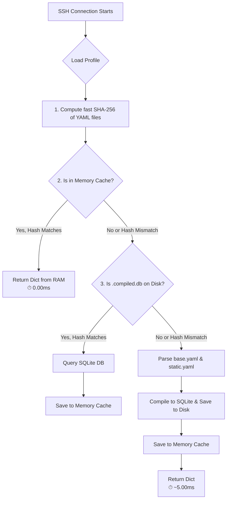

# VFS Profile Caching Architecture

This document explains the two-tier caching mechanism implemented in Cyanide's Virtual Filesystem (VFS) to optimize profile loading performance.

## The Problem

Cyanide simulates different Linux environments (Ubuntu, Debian, CentOS) using profiles defined in YAML (`base.yaml` and `static.yaml`). Previously, every time a new attacker connected via SSH or Telnet, the `FakeFilesystem` would re-parse these YAML files on the fly. 

While YAML parsing is relatively fast for a single connection, it becomes a significant bottleneck under heavy attack loads or when scaling the honeypot, as the same static data is repeatedly read from disk and parsed.

## The Solution: Two-Tier Cache

To solve this, Cyanide implements a **lazy, on-demand two-tier caching system** in `src/cyanide/vfs/profile_loader.py`. 

The system uses two layers:
1. **Memory Cache:** An ultra-fast, thread-safe in-memory Python dictionary.
2. **Disk Cache:** A pre-compiled `.compiled.db` file stored alongside the profile YAML files. SQLite provides rapid indexed access and binary storage, significantly outperforming YAML parsing.

### How it Works (Flowchart)



## Key Design Principles

### 1. Lazy Compilation (On-Demand)
The `.compiled.db` file is **not** created when the administrator saves the YAML file or starts the Docker container. 

Instead, compilation happens strictly **upon the first SSH/Telnet connection** to that specific profile. This reduces startup times and avoids compiling profiles that are never used.

### 2. Automatic Auto-Invalidation (Hash-Based)
Cache invalidation is notoriously difficult, but Cyanide handles it transparently via SHA-256 hashing.
- Every time a profile is requested, the system quickly hashes the contents of `base.yaml` and `static.yaml`.
- This target hash is compared against the hash stored inside the Memory Cache and the Disk Cache.
- If an administrator modifies `base.yaml` while the honeypot is running, the next SSH connection will result in a **hash mismatch**. The system will automatically discard the old caches, re-parse the YAML, and generate a fresh `.compiled.db`.

### 3. Preservation of Dynamic Context
The cache deliberately **does not** render Jinja2 templates or serialize Python execution logic.
- Fields requiring templating (`content: "Welcome to {{ os_name }}"`) are cached as raw strings. The `engine.py` still renders them dynamically per-session.
- Dynamic providers (e.g., `uptime_provider`) are cached purely as string references.

##  File Structure

The cache file lives directly inside the profile directory but is hidden and ignored by `.gitignore`.

```text
configs/profiles/ubuntu/
 base.yaml              # Metadata and dynamic file definitions
 static.yaml            # Static file definitions
 .compiled.db           #  Auto-generated binary cache
```

## 🧹 Maintenance

You do not need to manually delete `.compiled.db` when editing profiles. The hashing system guarantees that your YAML changes will take effect on the very next connection. If you wish to forcefully clear the cache for debugging, you can simply delete the `.compiled.db` files or restart the Python process.

---
<p align="center">
  <i>Revision: 1.0 • April 2026 • Cyanide Honeypot</i>
</p>
