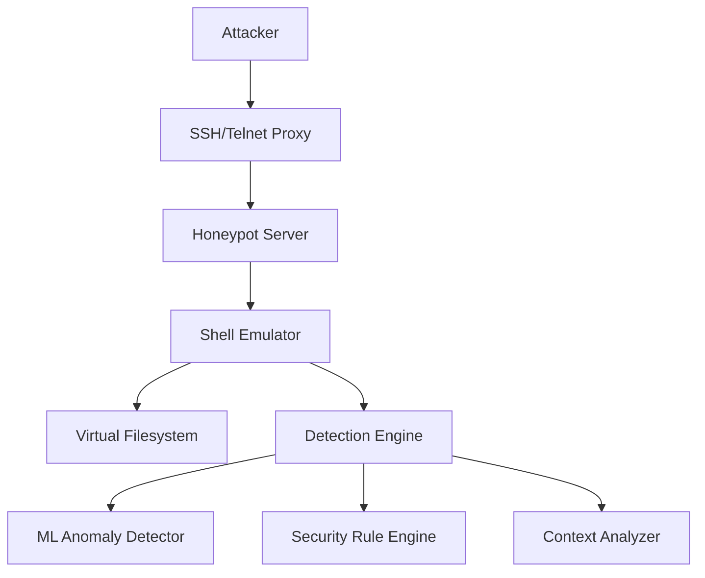
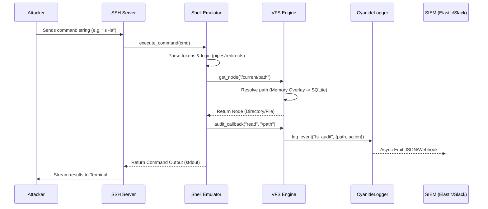

# Core Orchestration (`src/cyanide/core`)

This module forms the brain and the operational center of the Cyanide honeypot. It manages the server lifecycle, handles incoming connections, orchestrates backend VMs, and maintains the isolated state of every active session.

## System Overview

---

## 1. CyanideServer (`src/cyanide/core/server.py`)

The `CyanideServer` is the main entry point and lifecycle manager of the application. 

### Responsibilities:
- **Service Initialization:** On startup, it initializes the asynchronous networking listeners (e.g., SSH, Telnet, SMTP) and binds them to the configured host and ports.
- **Dependency Injection & Setup:** It sets up backend services shared across all sessions: `CyanideLogger` (rotation-capable centralized logging), `CleanupManager` (TTL-based quarantine/log sweep), `StatsManager` (Prometheus metrics), and `VMPool`.
- **Connection Dispatching:** Evaluates backend configurations. If `proxy` or `pool` mode is selected, it leverages the `TCPProxy` class to silently intercept and forward traffic. If `emulated` mode is selected, it traps the attacker in the `ShellEmulator`.
- **Health Checks & Monitoring:** Exposes HTTP endpoints (`/health`, `/metrics`, `/logs`) for orchestration probes (Docker/K8s) and SIEM observability.
- **Session Finalization:** When a connection drops, it flushes telemetry events and triggers lease releases dynamically back to the `VMPool`.

## 2. Shell Emulator (`src/cyanide/core/emulator.py`)

The `ShellEmulator` represents the simulated Linux shell environment presented to the attacker. It does not spawn a real underlying process; instead, it provides a highly convincing mock interface.

### Mechanism:
- **State Machine:** For every session, a new `ShellEmulator` instance is created. It tracks the `cwd` (Current Working Directory), the active `username` (e.g., admin or root), and any session-specific variables or aliases.
- **Parser Pipeline:** The emulator implements a custom parser to handle complex command lines. It understands:
  - Sequences and logic gates: `;`, `&&`, `||`
  - Piping: `|` (passing string data seamlessly between command handlers)
  - Redirections: `>`, `>>` (writing output to the VFS rather than the screen)
- **Command Dispatch:** Tokens are resolved against `aliases`. If a command matches an internal VFS command handler (e.g., `ls`, `cat`), it is executed. If it does not exist, a realistic `command not found` error is returned.
- **Permission Boundary:** The emulator works intimately with the VFS to enforce permissions `check_permission()`. For instance, actions in `/root` will prompt for a password or deny access unless the active user is correctly authenticated.

## 3. Session Management

Sessions represent the isolated context bounds of a single attacker.
- Every SSH or Telnet connection spawns an independent session ID.
- The state (history, VFS memory overlay) is strictly bound to this session to prevent attackers from interfering with one another or seeing each other's files.
- Session events (key presses, commands, login attempts) are forwarded to the `cyanide.logger` with the specific `session` UUID tag to ensure forensic traceability.

## Interaction Flows

### Command Execution Lifecycle
The following diagram illustrates how a command is processed from the moment an attacker presses "Enter" until the event reaches your SIEM.

Cyanide supports three distinct interaction models based on the `backend_mode` configuration:

### Flow A: Emulated (Simulated Shell)
1. Attacker connects via SSH (port 2222). `CyanideServer` accepts the connection.
2. The server instantiates a `FakeFilesystem` referencing a `static.yaml` OS Profile.
3. The attacker requests a PTY and types `ls -la > out.txt`.
4. The SSH handler passes this to `ShellEmulator.execute()`. Output is redirected and virtual files are created. The session remains entirely contained within python memory.

### Flow B: Pure Proxy (Man-in-the-Middle)
1. Attacker connects via Telnet.
2. `CyanideServer` initializes `TCPProxy` binding the connection directly to a configured `target_host:target_port` (e.g., an unpatched real IoT device).
3. The Proxy intercepts raw byte streams (`data_received`), logs them to the centralized analyzer, and forwards them transparently.

### Flow C: VM Pool (Libvirt Orchestration)
1. Attacker connects via SSH.
2. `CyanideServer` requests a `Lease` from the `VMPool`.
3. If Libvirt is enabled (`pool.mode = libvirt`), the pool automatically synthesizes a clone of `default_guest.xml`, starts the KVM guest, and identifies its dynamic IP via NAT.
4. `CyanideServer` connects the attacker to the newly spawned VM via `TCPProxy`.
5. Upon attacker disconnect, the `Lease` is dropped. The `VMPool`'s periodic collector gracefully destroys the VM, erasing all trace of the attacker's presence.

---

  <i>Revision: 1.0 • April 2026 • Cyanide Honeypot</i>

