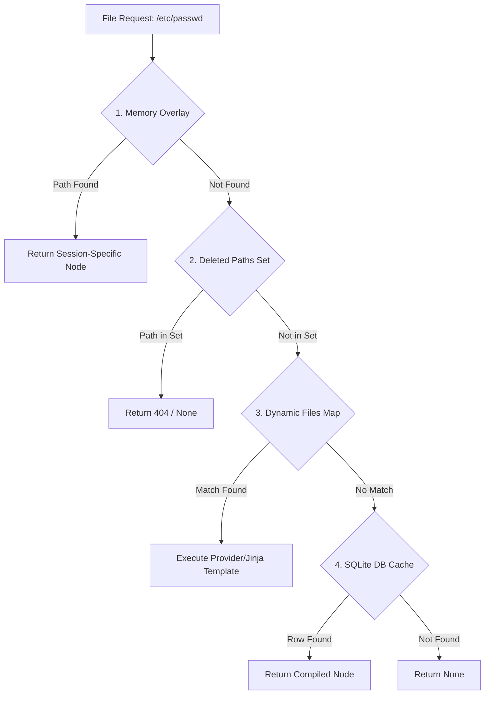

# Virtual Filesystem (VFS) Architecture (`src/cyanide/vfs`)

The Virtual Filesystem (VFS) provides a deeply convincing, synthetic Linux directory structure for the attacker. It achieves this without exposing the host OS by using memory overlays and a purely declarative specification.

## 1. Engine & Resolution Hierarchy
The VFS resolves file requests using a layered approach. This ensures that session-specific changes (like creating a file) override the base OS profile without modifying the original YAML.

- **Node Interface:** All internal paths resolve to `Node` subclasses (e.g., `VirtualDirectory`, `VirtualFile`). Every node contains UNIX attributes like `size`, `mtime`, `owner`, `group`, and `perm`.
- **Memory Overlay:** The `FakeFilesystem` class tracks state mutations in a `memory_overlay` dictionary. When an attacker modifies an existing file or creates a new directory, the changes are stored uniquely in their session's active memory overlay rather than replacing the base specification files.
- **Deleted Paths Set:** If an attacker deletes a file (`rm /etc/passwd`), the path is added to `deleted_paths`. The `FakeFilesystem` will subsequently report that the file no longer exists, even if it is defined in the static base YAML.

## 2. Profiles and Context

Instead of bundling multiple complete filesystem hierarchies, Cyanide relies on **Profiles** (`configs/profiles/`).
- **Context Layer:** Every session initializes a `Context` (Ubuntu, Debian, CentOS) carrying relevant metadata (Kernel version, OS string).
- **Static Manifests (`static.yaml`):** Contains massive lists of static binaries, placeholder configurations, and library structures. These paths are inherently lazy-loaded. 
- **Dynamic File Generation:** For files that vary per-server, the configuration defines Jinja2 templates. For example, the `content` property of `/etc/issue` might invoke `{{ os_name }}`. The `_render()` method populates these variables in real time when the file content is read (`get_content`).

## 3. Dynamic Providers (`src/cyanide/vfs/dynamic.py`)

Certain system paths require computationally generated string output that cannot be expressed purely via Jinja2 metadata.
- **Uptime Provider (`uptime_provider`):** Generates a realistic `/proc/uptime` output by simulating an OS boot time set in the randomized past and tracking realistic idle cycles.
- **CPU Info Provider (`cpuinfo_provider`):** Emits detailed, realistic multiprocessor data matching common Linux deployments instead of the real system's exact architecture.

### 3.1 Last Login Tracking

For enhanced realism, the VFS tracks the source IP of each attacker session.
- **First Login:** Attackers are shown a randomized, plausible management IP (e.g. `192.168.1.10`) in the "Last login" banner.
- **Subsequent Logins:** If the same source IP connects again, the honeypot displays their *own* previous IP as the last login source. This mimics standard Linux behavior and increases the perceived legitimacy of the server.
- This logic is handled by the `motd_provider` in `src/cyanide/vfs/dynamic.py` using a lightweight in-memory cache.

## 4. Caching System

Because parsing thousands of lines of `static.yaml` across active attacker sessions incurs overwhelming computational overhead, the VFS utilizes a **two-tier profile caching engine**. 
- See the dedicated **[VFS Profile Caching Architecture](../core/caching.md)** design doc for how Cyanide mitigates this via **SQLite** and SHA-256 auto-invalidation.

## 5. Command Implementation (`src/cyanide/vfs/commands/`)

Rather than deploying compiled ELF binaries into the honeypot, Cyanide natively implements essential commands directly in Python.
- Commands inherit from the base `Command` class and are mapped centrally via a registry.
- Examples include parsing pipelines via `awk`, executing `cat`, interacting with `systemctl`, and using `ping`.
- The `su` command implements root protection validation so attackers cannot arbitrarily escalate to the `/root` node without supplying correct credentials.

---

  <i>Revision: 1.0 • April 2026 • Cyanide Honeypot</i>

